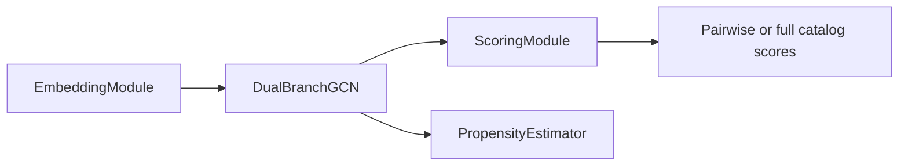

# EDGRec Architecture

Use this file for the live model structure: embeddings, propagation, scoring, and the public `EDGRec` surfaces used by training and evaluation.

## Key files

- `.agents/skills/edgrec-implementation/edgrec-architecture.md`
- `src/models/common.py`
- `src/models/embeddings.py`
- `src/models/lightgcn.py`
- `src/models/baselines/common.py`
- `src/models/baselines/lightgcn.py`
- `src/models/baselines/dice.py`
- `src/models/scoring.py`
- `src/models/propensity.py`
- `src/models/edgrec.py`

## Model path

Runtime path: embeddings/metadata -> graph propagation -> refined scorer -> optional propensity estimator for calibrated IPW.

## Component responsibilities

| Layer | Owner | Current contract |
| --- | --- | --- |
| Embedding layer | `EmbeddingModule` | Builds user and item embeddings, optional popularity embeddings, train-split metadata buffers, optional item-feature fusion inputs, and recent-history item-interest lookups for subgraph training. |
| Propagation layer | `DualBranchGCN` | Runs LightGCN propagation with explicit branch depths and optional sign-aware edge weights; EDGRec defaults to chunked edge-list aggregation and only uses the sparse-adjacency backend when explicitly requested. Stable sparse inputs are cached as coalesced tensors. Paper baselines may still use their prebuilt sparse-adjacency helper for paper-faithful full-graph propagation. |
| Scoring layer | `ScoringModule` | Produces pairwise and full-catalog interest, conformity, context, `score_mix_weights`, and fused final scores. |
| Propensity layer | `PropensityEstimator` | Optional two-layer MLP over propagated item embeddings, clipped to `[propensity_clip_min, propensity_clip_max]`. |
| Shared model helpers | `src/models/common.py` | Owns cross-model helper functions such as module dtype lookup and the training payload dictionary consumed by `LossSuite`. |
| Orchestrator | `EDGRec` | Wires the embedding, propagation, scoring, and optional propensity layers together for subgraph training and full-graph evaluation. |
| Paper baselines | `PaperLightGCN`, `PaperGCNDICE` | Separate canonical adapters for LightGCN and the DICE paper's GCN-DICE variant. They do not use `EmbeddingModule`, `ScoringModule`, side features, or EDGRec-specific score mixing. |

## Embedding and propagation rules

- `single_branch_gnn_layers` controls the single-branch path. `interest_gnn_layers` and `conformity_gnn_layers` control the dual-branch path.
- Feature fusion, when active:
  - condition: `use_features=True` and `item_features` exist,
  - normalize feature columns to `[0,1]`,
  - project item features once,
  - initialize side-feature gates from `feature_gate_init`,
  - interest input: `item_embed + gate * projected_features`,
  - conformity input: `item_embed + gate * (projected_features * popularity_gate)`.
- `item_popularity` and `item_recency` are registered once in the embedding layer and reused by both training and evaluation.

Propagation facts:

| Area | Contract |
| --- | --- |
| `LightGCNBranch` | repeated alpha-averaged layer outputs |
| EDGRec default | chunked `forward_edges()` aggregation on CPU/CUDA |
| EDGRec explicit sparse backend | coalesced sparse adjacency from `edge_index`/`edge_weight`, cached for stable non-gradient tensors |
| Paper baseline path | separate coalesced sparse-adjacency `forward()` helper retained for paper-faithful full-graph baselines |
| EDGRec/LightGCN norm | precomputed `edge_norm` |
| `PaperGCNDICE` norm | recomputes self-looped DICE GCN normalization |
| sign-aware no negatives | constant weights; no sparse edge-value gradients |
| sign-aware negatives | negative edges get `alpha_neg / alpha_pos` |

Item branch capacity:

- Default `separate_item_branch_embeddings=False`: one shared `item_embed`; raw embeddings may expose only `"item"`, and dual-branch propagation fans it into `"item_interest"` and `"item_conformity"`.
- Optional `separate_item_branch_embeddings=True`: dual-branch EDGRec creates `item_interest_embed` and `item_conformity_embed`, initializes both like the shared item table, exposes explicit branch item tensors, and keeps `"item"` as a stable fallback.
- `get_stacked_embeddings()` uses the interest item branch when explicit branch item tables exist, preserving a deterministic stacked embedding view.

## Score fusion

| Item | Contract |
| --- | --- |
| Outputs | `interest_score`, `conformity_score`, `context_score`, `score_mix_weights`, `final_score` |
| Raw diagnostics | `branch_interest_score`, `branch_conformity_score`, `raw_context_score` |
| Fusion logits | cosine-style interest/conformity + `tanh(raw_context_score)` |
| Raw branch use | branch BPR and diagnostics |
| Calibrated use | final ranking fusion |
| Context inputs | train-derived popularity, train-derived recency, optional calibrated propensity target, item age, safe item features |
| Context width | `4 + item_features_dim` |
| Propensity context gate | zero-fill unless `use_ipw=True` and `loss_weight_propensity_calibration > 0` |
| Active context gate | `use_popularity_head`, context head exists, safe metadata exists or calibrated propensity exists |
| Mix floor | `score_mix_min_weight` applies across active components by contract, not by current score value |

- `final_score` uses norm-invariant branch logits and bounded context logits, not raw dot-product magnitudes.
- `preset_full()` keeps learned structured mixing active and floors active components so conformity/context cannot silently collapse.
- `preset_full()` branch losses use DICE-conditioned popularity negatives by default.
- `preset_full()` initializes item side-feature gates at `feature_gate_init=-4.0`, so feature injection starts near zero and can be learned upward.
- `preset_lightgcn()` fixes the mixer to interest-only weights for the sampled LightGCN approximation.
- `preset_lightgcn_paper()` instantiates `PaperLightGCN`, which exposes the shared train/eval payload with interest-only dot-product scores.
- `preset_dice_like()` fixes the mixer to interest+conformity weights for the legacy DICE-like ablation.
- `preset_dice_paper()` instantiates `PaperGCNDICE`, which exposes interest, conformity, and summed final scores for DICE sampler/loss training.
- The `no_popularity_head` ablation removes only the context head; learned per-user mixing still applies over the active interest and conformity branches.
- The context head is item-only; no user features enter context scoring.
- Missing context fields are zero-filled.
- Fixed-weight normalization stays tensor-native inside the scorer, avoiding `.item()`-style device synchronization during pairwise and full-catalog scoring.
- `forward_subgraph()` resolves recent-train item histories by global item id before scoring so the short-term branch never indexes user history against a subgraph-local item table.

## Public `EDGRec` surfaces

| Method | Used by | Returns |
| --- | --- | --- |
| `forward_subgraph(batch)` | `MiniBatchTrainer` | One training payload for a sampled subgraph batch. |
| `get_propagated_for_eval(edge_index, edge_sign, edge_norm, ...)` | `Evaluator` | One reusable full-graph propagated state. |
| `score_users_from_propagated(propagated, user_ids, ...)` | `Evaluator` | Final `(batch_users, n_items)` score matrix. |
| `get_score_components_from_propagated(propagated, user_ids)` | `Evaluator` diagnostics path | Batched refined scorer outputs from the same propagated evaluation state. |
| `src/models/baselines/common.py` helpers | paper-baseline adapters | Shared channel propagation, pair scoring, full-catalog scoring, and fixed score-mix payloads. |
| `build_training_output(...)` | internal training path | Routes through `src/models/common.py` to build the shared payload containing scores, propagated tensors, optional IPW weights, optional DICE negative masks, and optional `propensity_scores`. |
