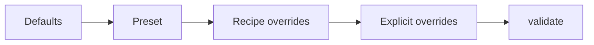

# EDGRec Configuration

Use this file for config ownership: defaults, presets, profiles, search spaces, grouped knobs, and override precedence.

## Key files

- `.agents/skills/edgrec-implementation/edgrec-config.md`
- `src/utils/config.py`
- `experiments/run_experiment.py`
- `experiments/recipes.py`
- `experiments/ablation_configs.py`
- `experiments/experiment_catalog.json`
- `experiments/search_spaces.json`

## Build order

Precedence:

- `build_config()`: defaults -> preset -> recipe overrides -> explicit overrides -> `validate()`.
- Paper presets re-apply locked fields after shared overrides.
- Locked paper fields include architecture, sampler, scheduler, optimizer, graph policy, and batch-size contract.
- Shared EDGRec profile knobs must not mutate `lightgcn_paper` or `dice_paper` paper defaults.

## Preset contract

| Preset | Current behavior |
| --- | --- |
| `lightgcn` preset (`EDGRecConfig.preset_lightgcn()`) | Scalable sampled-neighborhood LightGCN approximation: single branch with fixed interest-only mixing, no sign-aware weighting, no IPW, no popularity head, no side features, only `L_rec` active. |
| `lightgcn_paper` preset (`EDGRecConfig.preset_lightgcn_paper()`) | Paper-faithful LightGCN adapter: `PaperLightGCN`, single branch, full-graph propagation during training, observed graph only, no dropout, Adam optimizer with constant `lr=0.001` (`lr_scheduler="none"`), explicit ego-embedding L2 with `weight_decay=1e-4`, `batch_size=2048`, and no sampled-neighbor fan-out in the optimizer step. |
| `dice_like` preset (`EDGRecConfig.preset_dice_like()`) | Legacy DICE-like ablation: dual branch with fixed interest+conformity mixing, no sign-aware weighting, no IPW, no popularity head, no side features, branch BPR plus independence active. It is not the official DICE paper baseline. |
| `dice_paper` preset (`EDGRecConfig.preset_dice_paper()`) | Paper-faithful GCN-DICE adapter: `PaperGCNDICE`, dual self-looped LightGCN backbone branches, full-graph propagation during training, observed graph only, DICE popularity-conditioned negative sampling, DICE branch losses, Adam with constant `lr=0.001` (`lr_scheduler="none"`), DICE betas `(0.5, 0.99)`, and AMSGrad, `n_negatives=4`, `dropout=0.2`, `batch_size=128`, and DICE adaptive loss/margin decay enabled. |
| `edgrec` preset (`EDGRecConfig.preset_full()`) | Dual branch with learned score mixing over interest, conformity, and the item-only context head, sign-aware propagation, calibrated-IPW support disabled by default, item features used when available, DICE-conditioned popularity negatives with one negative per positive, DICE-style causal branch supervision, a small learned-mix floor to prevent branch collapse, `linear_ramp` schedule, and contrastive/DirectAU auxiliaries implemented but off by default. |

## Build rules

1. Recipe-owned fields are strict: conflicting explicit overrides raise instead of being silently merged.
2. If `preprocessing_preset` is unset, `build_config()` fills it from `src/data/loaders/_registry.py`.
3. `num_neighbors` must match `max_gnn_layers`, which is `single_branch_gnn_layers` in single-branch mode and `max(interest_gnn_layers, conformity_gnn_layers)` in dual-branch mode.
4. `auxiliary_loss_schedule` is the live auxiliary-schedule switch. The separate legacy field `loss_schedule` remains checkpoint-compatible, but the only supported value is `baseline`.
5. `lightgcn_paper` and `dice_paper` lock architecture-, sampler-, scheduler-, optimizer-, and batch-size-owned fields after shared overrides. Use separate tuned baseline presets if you need a fair-tuned table with intentionally changed paper defaults.
6. `validate()` is the final authority for config shape and contract checks.

## Key config groups

| Group | Fields | Current meaning |
| --- | --- | --- |
| Graph build | `graph_policy` | Observed train-interaction graph only. |
| Item universe | `item_universe_policy` | Compacts loaded interactions before graph/model construction; KuaiRand thesis-scale runs use randomized-exposure or observed-interaction item universes instead of all catalog IDs. |
| Model depth | `single_branch_gnn_layers`, `interest_gnn_layers`, `conformity_gnn_layers`, `num_neighbors` | Couples propagation depth to sampled fan-out. |
| Score fusion | `use_learned_score_mix`, `score_weight_interest`, `score_weight_conformity`, `score_weight_popularity`, `score_mix_min_weight`, `use_popularity_head` | Sets preset-owned priors and learned-vs-fixed fusion; baselines keep fixed mixing while `preset_full()` keeps learned `score_mix_weights`, and `score_mix_min_weight` applies only to learned components available by the model/data contract. |
| Item branch capacity | `separate_item_branch_embeddings` | Default `False` keeps one shared item table; `True` gives dual-branch EDGRec explicit interest/conformity item tables while retaining `"item"` fallback compatibility. |
| Loss and schedule | `loss_weight_*`, `branch_loss_mode`, `dice_mask_reduction`, `recommendation_loss_mode`, `auxiliary_loss_schedule`, `auxiliary_ramp_rate`, `independence_ramp_rate`, `distance_correlation_max_pairs`, `contrastive_max_pairs`, `contrastive_temperature`, `uniformity_max_pairs`, `uniformity_temperature`, `use_conformity_au`, `loss_weight_propensity_calibration`, `loss_normalization` | Enables auxiliaries, selects symmetric-vs-DICE branch supervision, sets masked-DICE reduction scale, caps quadratic auxiliary estimators, controls how weights activate, and optionally normalizes auxiliaries with detached EMA denominators. |
| Training mode | `training_graph_mode`, `negative_sampling_strategy`, `n_negatives`, `dice_sampler_margin`, `dice_sampler_pool`, `dice_branch_margin`, `dice_loss_decay`, `dice_margin_decay`, `dice_adaptive_decay` | Selects sampled-subgraph vs full-graph training and standard vs DICE popularity-conditioned negative sampling. |
| Optimizer memory | `embedding_optimizer`, `train_edge_keep_prob`, `use_popularity_emb` | Splits giant embedding tables from dense AdamW when requested, applies split-safe observed-edge dropout to propagation edges only, and avoids per-item popularity embeddings on large profiles. |
| Propensity | `use_ipw`, `propensity_hidden`, `propensity_clip_min`, `propensity_clip_max` | Controls the item-side propensity estimator; `use_ipw=True` requires positive `loss_weight_propensity_calibration`. |
| Runtime | `batch_size`, `auto_batch_size`, `batch_size_candidates`, `epochs`, `patience`, `use_early_stopping`, `use_amp`, `use_torch_compile`, `use_ema`, `lr_scheduler` | Controls optimization and execution behavior. CUDA runs default to `bfloat16` AMP; experiment CLIs do not expose a separate public AMP mode; eval cutoffs come from `Evaluator`. |
| Data | `dataset`, `preprocessing_preset`, `feature_policy`, `derived_split_mode`, `sample_interactions`, `loader_max_rows`, `seed` | Controls loader behavior, split derivation, and tiny-run caps. |

## Defaults worth remembering

- `graph_policy="observed"` is the default thesis path.
- CAGRA graph augmentation is not a supported config path.
- CAGRA config fields and CAGRA Optuna spaces are removed from the Python runtime; do not reintroduce ANN graph augmentation as a training-speed mechanism.
- `item_universe_policy="observed_interaction_items"` is the default; KuaiRand thesis-scale profiles override to `random_exposure_items_only` where the randomized-exposure diagnostic is intended.
- `embedding_optimizer="adamw"` keeps the old dense optimizer path; `"sparseadam"` and `"sgd"` split embedding tables into a separate low-state optimizer path for sampled EDGRec training.
- `train_edge_keep_prob=1.0` keeps all observed train edges; lower values drop only propagation/sampling edges and do not remove labels or split membership.
- The dataclass default schedule is `phased`, but `preset_full()` switches to `linear_ramp`.
- The dataclass default `propensity_clip_min` is `0.01`; `preset_full()` raises it to `0.1`.
- `use_ipw=False` is the dataclass and preset default. IPW must be explicitly enabled with `loss_weight_propensity_calibration > 0`.
- `use_features=True` is the dataclass default, but the non-causal presets disable side features.
- `score_mix_min_weight=0.0` is the dataclass default; `preset_full()` sets it to `0.05` so learned fusion cannot collapse to interest-only when conformity/context are available, even if a current batch gives one component zero-valued scores.
- `negative_sampling_strategy="standard"` is the dataclass default; `preset_full()` switches to DICE popularity-conditioned negatives with `n_negatives=1` and a stable `dice_branch_margin == dice_sampler_margin`.
- `dice_mask_reduction="batch_mean"` is the dataclass and paper-DICE default; `preset_full()` uses `active_mean` so DICE branch BPR scale does not vanish when the active mask is sparse.
- `feature_gate_init=0.0` is the dataclass default; `preset_full()` uses `-4.0` so side features start near zero contribution (`sigmoid(-4) ~= 0.018`).
- `separate_item_branch_embeddings=False` is the default; enable it only through EDGRec search/profile overrides when testing DICE-like item branch capacity.
- `loss_normalization="none"` is the default; `"ema_aux"` normalizes auxiliary losses only and leaves the main recommendation BPR scale unchanged.
- `use_amp=True` is the default runtime path, and `amp_dtype` is fixed to `bfloat16`.
- Dataclass batch default: `batch_size=4096`, `auto_batch_size=True`, candidates `[16384,8192,4096,2048,1024,512,256]`.
- Active model-selection searches use the largest-feasible auto-batch ladder `[1048576,524288,262144,131072,65536,32768,16384,8192,4096,2048,1024,512,256]`; the selected batch is runtime metadata, not a sampled thesis mechanism.
- In `edgrec-core-optimization`, `batch_size` is runtime metadata when auto-batch is active and `batch_size` is not a sampled parameter.
- Too-large CUDA batches are rejected by probe/verification/fallback and retried at smaller candidates.
- Auto-batch recovery checks candidate checkpoint identities before probing CUDA again.
- EDGRec search is coarse-to-focused: completed datasets can narrow basins; KuaiRand stays broader until fresh local evidence exists.
- Search-space TPE uses stable univariate flags: `multivariate=false`, `group=false`.
- `loss_weight_propensity_calibration=0.0` is opt-in and stays inactive unless model outputs, dataset targets, and explicit IPW/calibration config exist.
- `distance_correlation_max_pairs=1024` and `uniformity_max_pairs=2048` cap quadratic auxiliary estimators while preserving deterministic hash-sampled coverage across epochs.

## Formal profile map

| Profile | Purpose | Notes |
| --- | --- | --- |
| `dev-edgrec` | Short EDGRec development profile. | Core datasets; observed graph; 60 epochs. |
| `core-edgrec-mainline` | Default formal thesis profile. | EDGRec only; core datasets; paper baselines split out. |
| `core-edgrec-mainline-opposite-fanout-smaller-lr` | Fan-out/LR sanity check. | Small/medium aliases; EDGRec only. |
| `paper-lightgcn-*` | Run-once LightGCN paper baselines/probes. | Full-graph `PaperLightGCN`; fixed paper contract. |
| `paper-dice-all-runtime-probes` | DICE paper feasibility estimates. | One epoch; logs `approximation` split estimates. |
| `fast-baseline-tuning` | Fallback sampled non-paper baselines. | Report separately from paper-faithful baselines. |
| `core-deeper-comparison-i2-c3` | Deeper EDGRec branch comparison. | Keeps flat fan-out sweep `[[10,5,3],[5,3,2]]`. |
| preprocessing sweeps | Dataset-view selection. | Taobao, KuaiRec, KuaiRand explicit profiles only. |

## Optuna search map

| Space | Base | Datasets | Objective | Sampler/pruner | Runtime contract |
| --- | --- | --- | --- | --- | --- |
| `edgrec-core-optimization` | `core-edgrec-mainline` | core 4; start diagnostics with MovieLens1M and KuaiRec_v2; KuaiRand uses `observed_interaction_items` as a separate sanity regime | `ValidationOnlineCRRU@20_40` | TPE seed 42, startup 4; Hyperband min 6, factor 3, bootstrap 1 | `max_epochs=60`, `trials=8`, largest-feasible auto-batch runtime-only, tunes `dice_mask_reduction`, `feature_gate_init`, `n_negatives`, branch weights, context/feature shortcuts; `hard_negative_ratio` excluded for DICE |
| `edgrec-mechanism-coarse` | `core-edgrec-mainline` | KuaiRec_v2, MovieLens1M, KuaiRand1K randomized-exposure regime; no AmazonBook broad pass | `ValidationAccuracy@20_40` | TPE seed 42, startup 40; Hyperband min 6, factor 3, bootstrap 1 | `max_epochs=60`, `trials=30`, largest-feasible auto-batch runtime-only, focused profile labels and sibling `profile_overrides` maps them to concrete score-fusion, item-branch, context/feature, loss, and graph-depth config overrides before `EDGRecConfig` is built; dataset-local scalar overrides cover MovieLens score floor `0.1` and wider KuaiRand DICE margins |
| `edgrec-lite-kuairec-search` | `edgrec-lite-kuairec` | KuaiRec_v2 only | `ValidationOnlineCRRU@20_40` | TPE seed 42, startup 8; Hyperband min 6, factor 3, bootstrap 1 | Samples `preprocessing_preset` over `kuairec_big_matrix_watch_ratio_threshold_0_5`, `kuairec_big_matrix_watch_ratio_threshold_0_75`, and `kuairec_big_matrix_watch_ratio_threshold_1_0`; the search-space revision changes when this axis changes, so old same-study trials do not satisfy the fresh-trial budget. |

## Experiment-facing contract

- The formal experiment grid is **dataset x preset**.
- Support parameters such as `batch_size`, `num_neighbors`, and `lr_scheduler` are profile-owned runtime choices for EDGRec and tuned/fallback baselines, not thesis axes. EDGRec Optuna spaces can tune them for model selection, but final thesis tables should report them as selected runtime/optimization settings rather than as causal contributions. Paper baselines lock their paper-owned values, including constant LR scheduling.
- `graph_policy` is fixed to the observed train-interaction graph; profile payloads may state `"observed"` explicitly, but there is no graph-policy sweep surface.
- Formal profiles and runtime config mappings may override existing score-fusion, loss-weight, auxiliary-schedule, and bounded-pair estimator fields so controlled causal-loss ablations are reproducible through the same checkpoint identity surface as the mainline.
- Formal profiles may sweep `num_neighbors` or preprocessing presets as lists, but each resolved run still receives one concrete value in the final `EDGRecConfig`.
- The default formal profile is `core-edgrec-mainline` and targets the practical core datasets: `amazonbook`, `movielens1m`, `kuairec_v2`, and `kuairand1k`. Development, preprocessing-sweep, runtime-probe, `taobao`, and `movielens20m` profiles remain explicit instead of default catalog entries.
- Public ablation variants start from `preset_full()`: `mainline`, `with_contrastive`, `no_popularity_head`, `no_independence`, and `no_features`. `with_contrastive` is the only additive variant; it enables the bounded DCCL-style branch contrastive auxiliary that remains off in the default mainline.
- CAGRA graph augmentation and CAGRA-specific Optuna spaces are removed. They did not target the current training-time VRAM/epoch bottleneck, and no CAGRA config field is part of the active Python runtime.
