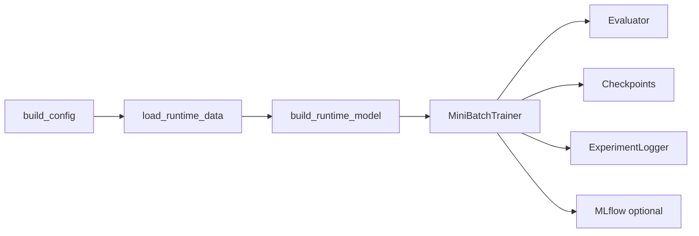

# EDGRec Training

Use this file for the live runtime path: trainer setup, evaluation, checkpoint identity, and experiment tracking.

## Key files

- `.agents/skills/edgrec-implementation/edgrec-training.md`
- `src/utils/trainer_runtime.py`
- `src/training/mini_batch_trainer.py`
- `src/training/evaluator.py`
- `src/profiling/gpu_profiler.py`
- `src/utils/experiment_logger.py`
- `src/utils/crru.py`
- `experiments/run_experiment.py`
- `experiments/run_benchmark.py`
- `experiments/run_search.py`
- `experiments/search_spaces.json`
- `experiments/cli_parsers.py`
- `scripts/query_results.py`

## Runtime flow

Single-run path: config -> data/graph -> model -> sampled/full training -> eval -> checkpoint/logging. Benchmark, ablation, and search reuse this path.

## Supported entry points

| Command | Current role |
| --- | --- |
| `uv run experiment` | One explicit run. |
| `uv run ablation` | Thesis-facing ablation sweep over named variants. |
| `uv run formal-run` | Profile-driven formal matrix with strict resume state; accepts comma-separated profile queues. |
| `uv run search-experiments` | Optuna EDGRec search over declarative search spaces; validation-only by default; accepts comma-separated search-space queues. |
| `uv run quick-validate` | Fixed smoke suite over the shared runtime path with SQLite and MLflow logging disabled. |
| `uv run query-results` | SQLite-first result/report inspection surface. |

CLI rule: commands select work; recipes, presets, ablation variants, profiles, and search spaces own semantics.

## Runtime responsibilities

| Step | Owner | Contract |
| --- | --- | --- |
| 1 | `build_config()` | resolve one `EDGRecConfig` |
| 2 | `load_runtime_data()` | load canonical data; build requested graph policy |
| 3 | `build_runtime_model()` | paper adapters for paper presets; else derive recency/history/propensity tensors and instantiate `EDGRec` |
| 4 | `run_experiment()` | attach `data.propensity_targets`; resolve auto-batch; build identities |
| 5 | `MiniBatchTrainer.train()` | sampled mode uses `data.train_positive_mask`; full mode propagates full graph per step |
| 6 | `Evaluator.evaluate()` | one full-graph propagated state; relevance is `labels > 0` |
| 7 | `ExperimentLogger` | SQLite source of truth; MLflow mirror when enabled |

## `TrainerRuntime`

`TrainerRuntime` owns:

- device setup and shared move helpers,
- optimizer construction,
- default CUDA AMP (`bfloat16` on CUDA),
- optional EMA state,
- scheduler and early-stopping state,
- checkpoint save and load,
- cached `popularity` and optional `propensity_targets`,
- cached raw train-only `popularity_count` for DICE-style branch masks and negative sampling,
- evaluator construction and shared logging hooks.

Optimizer map:

| Family | Optimizer contract |
| --- | --- |
| EDGRec | AdamW; fused CUDA kernels when available |
| `lightgcn_paper` | Adam; explicit ego-embedding L2 handled in loss |
| `dice_paper` | Adam; DICE betas `(0.5,0.99)`; AMSGrad |

Important runtime details:

- experiment runner sets `PYTORCH_ALLOC_CONF=expandable_segments:True` before importing `torch` unless user configured CUDA allocator policy,
- legacy `PYTORCH_CUDA_ALLOC_CONF` is accepted as source value,
- sign-aware scalars (`alpha_pos`, `alpha_neg`) live in a zero-weight-decay optimizer group,
- `use_torch_compile` is opt-in because sampled subgraphs are too dynamic for a default compile win,
- best validation state is tracked even when `use_early_stopping=False`,
- training continuation checkpoints keep the latest optimizer/RNG state for resume,
  while finished-training and recovery evaluation load the best validation model
  state when available,
- finished-checkpoint recovery is checked before dataset auto-batch probing; when
  `auto_batch_size=True`, the lookup tries the configured candidate batch-size
  identities and binds the saved batch size instead of probing CUDA again,
- Optuna search can attach a training epoch callback to `MiniBatchTrainer.train()`;
  the callback reports validation objective values only on epochs where validation
  ran and raises `TrialPruned` when the configured Optuna pruner stops an
  unpromising trial. Normal experiment, formal-run, and baseline paths leave this
  callback unset,
- EDGRec train-derived model tensors (`item_recency`, recent-train history, and
  optional propensity targets) are cached on the runtime graph payload so
  auto-batch probe model rebuilds reuse split-safe CPU tensors instead of
  recomputing per candidate,
- Optuna objectives are validation-only. `ValidationAccuracy@20_40` is the broad
  discovery objective for the coarse mechanism search; every completed search row
  should still store `ValidationOnlineCRRU@20_40` diagnostics so reports and figures
  can compare all source studies through one OnlineCRRU validation objective,
- `search-experiments --trials N` targets N fresh informative finished trials for the
  current `search_space_revision`: fresh `COMPLETE` plus trainer/pruner-generated
  `PRUNED`, excluding `FAIL`, `RUNNING`, historically imported rows, duplicate-skip
  prunes, and rows from other revision hashes. Imported rows are report-only provenance
  and never satisfy the fresh local target,
- `search-experiments --space a,b` runs search spaces sequentially with the same
  `--dataset` and `--trials` applied to each space; omit `--study-name` for queues
  so normal per-space/per-dataset study names remain unambiguous,
- promoted `formal-run` EDGRec profiles may pass `batch_size` as `[trial batch,
  2x trial batch]`; the first value is the required formal candidate, while a
  CUDA OOM on later batch candidates is skipped and the queue continues,
- completed Optuna trials store sampled params, runtime attrs, and dataset-scoped effective configs,
- promotion reports should show effective configs so resolved auto-batch size is visible,
- validation retries once on CUDA after optimizer-state offload, then falls back to CPU if evaluation still OOMs,
- a late auto-batch training OOM releases the failed trainer and resumes the next smaller candidate from the latest completed-epoch checkpoint when one exists,
- auto-batch OOM logs include exception summary and PyTorch CUDA allocated/reserved/peak stats,
- probe OOM logs add failing stage and sampled-subgraph dimensions when available,
- scheduler stepping and early-stopping patience both wait until `max(auxiliary_losses_start_epoch, popularity_supervision_start_epoch)`.
- training interaction tensors use `data.train_positive_mask` when present, falling back to `train_mask & labels > 0`.

## `MiniBatchTrainer`

`MiniBatchTrainer` is the only trainer.

- In sampled mode, on CUDA it first tries to stage the full graph into a CUDA-resident `SubgraphSampler`.
- If sampled graph staging or later batch preparation reports a CUDA OOM, including plain RuntimeError messages from CUDA kernels, it falls back to the CPU sampler path.
- Sampled BFS memory scales with `frontier_size * num_neighbors[hop]`, not total incident degree.
- EDGRec sampled propagation defaults to chunked edge-list aggregation on CPU/CUDA. The explicit sparse-adjacency backend builds coalesced tensors and reuses one stable runtime cache entry when edge weights do not require gradients.
- Full-graph mode skips subgraph extraction and propagates the full train graph per optimizer step.
- Full-graph mode is used by `lightgcn_paper` and `dice_paper`.
- Full-graph mode stages `edge_index`, `edge_sign`, and `edge_norm` once per trainer/device.
- Full-graph mode releases CUDA graph cache before validation.

Trainer family map:

| Family | Runtime contract |
| --- | --- |
| `lightgcn_paper` | `PaperLightGCN`; no dropout/features/mixer; observed graph; Adam; ego L2 |
| `dice_paper` | `PaperGCNDICE`; separate branches; self-looped DICE LightGCN; dropout; summed final score |
| EDGRec DICE negatives | raw train-only counts; `dice_sampler_margin`; `dice_sampler_pool`; `n_negatives=1`; vectorized known-positive filtering |
| `dice_paper` negatives | external-code `n_negatives=4`; exact per-user pool-count correction |
- Sampled and full-graph training both pass the current epoch into the negative sampler. The DICE sampler margin decays only when `dice_adaptive_decay=True`.
- CPU-prepared `SubgraphBatch` objects are pinned and copied with `non_blocking=True`.
- Batch-local auxiliary losses operate on the batch users and selected positive items, not the full sampled frontier.
- The trainer slices local normalized popularity, local raw branch popularity, and local propensity targets by `sub_batch.item_global_ids` before calling `LossSuite`.
- Epoch logging cheaply aggregates scalar loss diagnostics emitted by `LossSuite`, including raw recommendation/auxiliary losses, DICE mask rates, score-mix means, normalized auxiliary losses when `loss_normalization="ema_aux"`, and weighted auxiliary contributions.
- DEBUG logging emits batch loss components plus IPW, propensity-target, and score summaries for the sampled batch.

## Evaluator

`Evaluator` computes the thesis-primary PyG metric bundle:

- `NDCG@20`
- `Recall@20`
- `AveragePopularity@20`
- `HitRatio@20`
- `Personalization@20`
- `NDCG@40`
- `Recall@40`
- `AveragePopularity@40`
- `HitRatio@40`
- `Personalization@40`

Current evaluation rules:

- relevance ground truth is `target_mask & labels > 0`; non-positive observed rows are never counted as relevant,
- validation excludes training interactions only,
- test excludes both training and validation interactions, including when the caller passes an equivalent copied test mask,
- full-graph propagation happens once per evaluation call,
- validation logs only the thesis-primary metrics; refined scorer diagnostics are reserved for the final post-training test pass,
- do not reintroduce custom Novelty, TrainPop Avoidance, item-pop IoU, or other paper-nonstandard ranking outputs unless a paper-faithful definition is implemented and justified,
- default thesis outputs stay PyG-standard plus easy-to-defend diagnostics,
- split-specific ground-truth and exclusion dictionaries are cached by mask identity.

Diagnostic rules:

| Area | Contract |
| --- | --- |
| batch cap | split-aware 512 MiB score-matrix cap |
| component export | budgets extra headroom for interest/conformity/context/final views |
| reuse | same propagated state and top-k recommendations as thesis metrics |
| accumulation | native-dtype top-k slices; float accumulation math |
| score-mix stats | `score_mix_*` mean/std |
| contribution stats | weighted branch contributions and interest/conformity contribution ratios at `@20/@40` |
| branch checks | interest-vs-conformity cosine |
| popularity checks | per-component popularity Spearman |
| branch-collapse warnings | flag conformity mix above `0.8`, interest mix below `0.1`, or branch cosine magnitude above `0.9` |
| seen masking | final and standalone branch rankers are masked |
| context diagnostics | read-only at already-excluded final top-k recommendations |
| branch rankers | raw interest/conformity PyG `NDCG`, `Recall`, `AveragePopularity` |
| thesis role | exploratory diagnostics only; not primary metrics and not causal proof |

Quick validation uses larger tiny caps for sparse-positive Taobao and KuaiRand slices so label-aware validation/test splits contain positive targets.

CAGRA evaluation filtering and CAGRA graph augmentation are not part of the active runtime. Training memory work is owned by item-universe compaction, sparse/low-state embedding optimizers, bounded fan-out, and observed-edge dropout.

## CRRU reporting utility

Facts:

- `CRRU@K` = Composite Resource-aware Recommendation Utility at K.
- Use: thesis-facing ranking utility family for completed formal/ablation rows.
- Not: causal-effect estimator.
- Not: universal recommender metric.
- Direction: higher is better.
- Parameterization: `CRRU@K(m; theta)`; weights encode task/stakeholder preference.
- Lower-cost raw quantities are inverted: average popularity, VRAM, seconds/epoch.
- VRAM is a capacity/resource cost, not a reward.
- Larger batches can improve CRRU only if time/epoch gains offset VRAM penalty.
- Normalization scope: dataset-local report section rows.
- Lower-cost quantities are inverted after min-max normalization.
- Interpretation scope: relative within a dataset/report section; adding/removing rows can change values.
- Inverse AvgPop measures lower popularity concentration, not causal fairness.

$$
\operatorname{Accuracy}@K =
\operatorname{NDCG}@K^{0.50}
\operatorname{Recall}@K^{0.35}
\operatorname{Hit}@K^{0.15}
$$

$$
\operatorname{PopularityDiversity}@K =
\operatorname{Pers}@K^{0.40}
\left(1 - \operatorname{AvgPop}@K_n\right)^{0.60}
$$

$$
\operatorname{Efficiency} =
\left(1 - \log(1+\operatorname{VRAM})_n\right)^{0.50}
\left(1 - \log(1+\operatorname{time/epoch})_n\right)^{0.50}
$$

$$
\operatorname{CRRU}@K =
\operatorname{Accuracy}@K^{0.55}
\operatorname{PopularityDiversity}@K^{0.30}
\operatorname{Efficiency}^{0.15}
$$

Thesis default `theta`:

| Component | Weight |
| --- | ---: |
| Accuracy `NDCG/Recall/Hit` | `0.50 / 0.35 / 0.15` |
| Popularity-Diversity `Personalization/inverse AvgPop` | `0.40 / 0.60` |
| Efficiency `inverse log VRAM/inverse log time per epoch` | `0.50 / 0.50` |
| Final `Accuracy/Popularity-Diversity/Efficiency` | `0.55 / 0.30 / 0.15` |

Implementation normalization:

$$
x_n = \frac{x - \min(x)}{\max(x) - \min(x) + \epsilon}
$$

- `epsilon=1e-8` prevents divide-by-zero and exact-zero fractional-power terms.
- Min-max is used because CRRU terms must stay bounded in `[0,1]`.
- Z-score is avoided: negative/unbounded values break fractional-power products.

Optuna CRRU:

| Item | Contract |
| --- | --- |
| Live/default report metric | `ValidationOnlineCRRU@20_40` |
| Per-K attrs | `ValidationOnlineCRRU@20`, `ValidationOnlineCRRU@40` |
| Accuracy/popularity-diversity inputs | validation NDCG, Recall, Hit, Personalization |
| Lower-cost inputs | validation AveragePopularity, peak VRAM, seconds/epoch |
| Lower-cost transform | deterministic trial-local higher-is-better transform |
| Report CRRU | recomputed after completed rows exist; not live objective |
| Search shape | 150-epoch cap guarded by Hyperband pruning and early stopping; no exhaustive grid |
| Depth guard | four-hop excluded unless separate deep diagnostic justifies cost/risk |

Naming note: `OnlineCRRU` means Optuna-safe single-trial CRRU-style objective on the validation split. It includes validation ranking/popularity metrics, seconds/epoch, and peak VRAM; it is not an online-serving or A/B-test metric.

## Checkpoints and identity

| Identity | Purpose |
| --- | --- |
| `training_identity` / `training_hash` | Resume compatibility and checkpoint path identity |
| `evaluation_identity` / `evaluation_hash` | Same-checkpoint metric comparability |

Current rules:

- the default checkpoint filename includes `training_hash`,
- changing a training-defining field requires a new checkpoint,
- evaluation cutoffs are fixed by `THESIS_EVAL_KS` in `Evaluator`, so checkpoint
  filenames are keyed by training identity rather than report-display options,
- an incomplete checkpoint marked `training_finished` or a legacy checkpoint whose
  early-stopping patience already fired is re-evaluated from `best_state` instead
  of continuing training,
- before auto-batch probing, recovery lookup searches exact and auto-batch
  candidate checkpoint identities, so a saved best checkpoint can be evaluated
  without repeating the representative CUDA batch probe,
- `--overwrite-checkpoint` deletes the resolved checkpoint before a fresh run starts.

## Experiment tracking

- SQLite primary DB: `results/thesis_experiments.db`.
- `ExperimentLogger` stores configs, metrics, profiling data, hashes, provenance.
- MLflow is secondary UI/artifact mirror, not source of truth.
- Evaluator diagnostics use the same metric logging path as thesis metrics.
- `search-experiments` default Optuna storage: `sqlite:///results/optuna_studies.db`.
- Search runs use existing runtime; default `evaluate_test=False`; checkpointing and MLflow stay opt-in/lightweight by search config.
- Quick validation uses existing runtime with `log_to_sqlite=False`, `enable_mlflow=False`, and temporary resume checkpoints, so it does not write smoke rows to the thesis or MLflow databases.
- `formal-run` state file: `results/formal_run_state.json`.
- Formal state is a strict resume pointer, not a profile definition.
- Comma-separated `--profile` values run sequentially; state tracks active/latest profile.
- Runtime-probe profiles: `config_overrides.epochs=1` + profile-level `runtime_probe.target_epochs`.
- Runtime-probe estimates log canonical `RUNTIME_PROBE_METRIC_NAMES` under SQLite split `approximation`.
- Resource metrics: `gpu_utilization_pct` avg train GPU utilization; `max_gpu_utilization_pct` peak sampled train utilization.
- VRAM metrics: `train_peak_vram_allocated_mb`, `train_peak_vram_reserved_mb`, `train_peak_gpu_memory_used_mb`.
- Legacy `peak_vram_mb`: training `nvidia-smi` peak when available; PyTorch allocated peak fallback.
- Naming owner: `src/utils/experiment_naming.py`.
- Shared labels feed checkpointing, benchmark summaries, MLflow params, profile slugs, and `query-results`.
- Query views owner: `ExperimentLogger.VIEW_TABLES`.
- Query views: `completed`, `attention`, `errors`, `comparison`.
- Default `query-results` writes Markdown headings and pipe tables.
- Report sections: final formal thesis profiles, supporting historical/preprocessing rows, runtime-probe notes, public ablations.
- Runtime probes are visible but excluded from ranked formal tables.
- Ranked sections split tables into accuracy, popularity-diversity, and composite-resource blocks.
- `CRRU@20` and `CRRU@40` stay in composite-resource tables and are dataset-local section-row min-max utilities.
