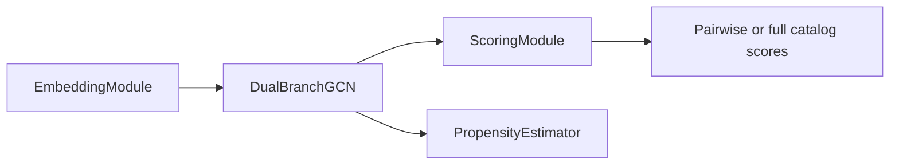

# U-CaGNN Architecture

Use this file for the live model structure: embeddings, propagation, scoring, and the public `UCaGNN` surfaces used by training and evaluation.

## Key files

- `.agents/skills/ucagnn-implementation/ucagnn-architecture.md`
- `src/models/embeddings.py`
- `src/models/lightgcn.py`
- `src/models/baselines/lightgcn.py`
- `src/models/baselines/dice.py`
- `src/models/scoring.py`
- `src/models/propensity.py`
- `src/models/ucagnn.py`

## Model path

The diagram shows the runtime path: the embedding layer prepares tables and metadata, the propagation layer updates them over the graph, the scoring layer produces ranking scores, and the optional propensity layer produces item-side propensity scores for IPW.

## Component responsibilities

| Layer | Owner | Current contract |
| --- | --- | --- |
| Embedding layer | `EmbeddingModule` | Builds user and item embeddings, optional popularity embeddings, train-split metadata buffers, optional item-feature fusion inputs, and recent-history item-interest lookups for subgraph training. |
| Propagation layer | `DualBranchGCN` | Runs LightGCN propagation with explicit branch depths and optional sign-aware edge weights; U-CaGNN uses uncoalesced CUDA sparse COO matmul or CPU chunked edge-list aggregation while paper baselines may still use prebuilt sparse adjacency helpers. |
| Scoring layer | `ScoringModule` | Produces pairwise and full-catalog interest, conformity, context, `score_mix_weights`, and fused final scores. |
| Propensity layer | `PropensityEstimator` | Optional two-layer MLP over propagated item embeddings, clipped to `[propensity_clip_min, propensity_clip_max]`. |
| Orchestrator | `UCaGNN` | Wires the embedding, propagation, scoring, and optional propensity layers together for subgraph training and full-graph evaluation. |
| Paper baselines | `PaperLightGCN`, `PaperGCNDICE` | Separate canonical adapters for LightGCN and the DICE paper's GCN-DICE variant. They do not use `EmbeddingModule`, `ScoringModule`, CAGRA augmentation, side features, or U-CaGNN-specific score mixing. |

## Embedding and propagation rules

- `single_branch_gnn_layers` controls the single-branch path. `interest_gnn_layers` and `conformity_gnn_layers` control the dual-branch path.
- When `use_features=True` and `item_features` exist, `EmbeddingModule` first normalizes feature columns to `[0, 1]`, projects item features once, and builds branch-aware item inputs:
  - `item_interest = item_embed + gate * projected_features`
  - `item_conformity = item_embed + gate * (projected_features * popularity_gate)`
- `item_popularity` and `item_recency` are registered once in the embedding layer and reused by both training and evaluation.
- `LightGCNBranch` uses repeated alpha-averaged layer outputs. U-CaGNN builds uncoalesced CUDA sparse COO adjacency from `edge_index`/`edge_weight` to avoid per-batch sparse COO coalescing workspaces, and falls back to chunked `forward_edges()` aggregation on CPU; paper baselines can still call the coalesced sparse-adjacency `forward()` path. Degree normalization comes from precomputed `edge_norm` for U-CaGNN and LightGCN; `PaperGCNDICE` recomputes the self-looped DICE GCN normalization internally.
- Sign-aware weighting only changes mixed-sign graphs. On all-positive or positive+neutral graphs, weights are constant and do not request sparse edge-value gradients; when negative edges exist, they receive weight `alpha_neg / alpha_pos`, which downweights their propagation effect.

## Score fusion

- `ScoringModule` always emits calibrated diagnostic components `interest_score`, `conformity_score`, `context_score`, `score_mix_weights`, and `final_score`, plus raw branch scores as `branch_interest_score`, `branch_conformity_score`, and `raw_context_score`. The context head can use train-derived popularity/recency and safe item features by default; post-treatment propensity targets enter the context input, and count as active context metadata for score mixing, only for explicitly calibrated IPW runs.
- `final_score` is fused from norm-invariant branch logits and bounded context logits, not raw dot-product magnitudes. This keeps score-mix weights meaningful: a small conformity/context weight cannot dominate ranking only because that branch has larger embedding norms.
- `preset_full()` keeps the learned structured mixer active and applies `score_mix_min_weight` across available components so conformity/context cannot silently collapse to zero contribution. Availability is determined by the model contract (`use_dual_branch`, context head enabled, and item context metadata present), not by whether a batch's current component scores are nonzero. Its branch losses are fed by DICE-conditioned popularity negatives by default.
- `preset_lightgcn()` fixes the mixer to interest-only weights for the sampled LightGCN approximation.
- `preset_lightgcn_paper()` instantiates `PaperLightGCN`, which exposes the shared train/eval payload with interest-only dot-product scores.
- `preset_dice_like()` fixes the mixer to interest+conformity weights for the legacy DICE-like ablation.
- `preset_dice_paper()` instantiates `PaperGCNDICE`, which exposes interest, conformity, and summed final scores for DICE sampler/loss training.
- The `no_popularity_head` ablation removes only the context head; learned per-user mixing still applies over the active interest and conformity branches.
- The context head remains item-only. Popularity is now just one context field alongside recency, propensity targets, item age, and bounded safe item features, with zero fill for any missing field.
- Fixed-weight normalization stays tensor-native inside the scorer, avoiding `.item()`-style device synchronization during pairwise and full-catalog scoring.
- `forward_subgraph()` resolves recent-train item histories by global item id before scoring so the short-term branch never indexes user history against a subgraph-local item table.

## Public `UCaGNN` surfaces

| Method | Used by | Returns |
| --- | --- | --- |
| `forward_subgraph(batch)` | `MiniBatchTrainer` | One training payload for a sampled subgraph batch. |
| `get_propagated_for_eval(edge_index, edge_sign, edge_norm, ...)` | `Evaluator` | One reusable full-graph propagated state. |
| `score_users_from_propagated(propagated, user_ids, ...)` | `Evaluator` | Final `(batch_users, n_items)` score matrix. |
| `get_score_components_from_propagated(propagated, user_ids)` | `Evaluator` diagnostics path | Batched refined scorer outputs from the same propagated evaluation state. |
| `get_all_score_components(...)` | diagnostics and same-checkpoint evaluation tooling | Full-catalog component scores plus branch embeddings when dual-branch is active. |
| `build_training_output(...)` | internal training path | Shared payload containing scores, propagated tensors, optional IPW weights, optional DICE negative masks, and optional `propensity_scores`. |
