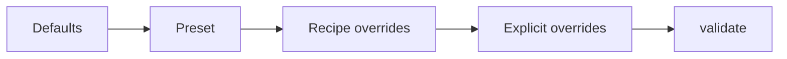

# U-CaGNN Configuration

Use this file for the config contract: presets, grouped knobs, and how runtime configs are assembled from defaults, recipes, profiles, and explicit overrides.

## Key files

- `.github/skills/ucagnn-implementation/ucagnn-config.md`
- `src/utils/config.py`
- `experiments/run_experiment.py`
- `experiments/recipes.py`
- `experiments/ablation_configs.py`

## Build order

The diagram shows the only supported precedence order. `build_config()` starts from `UCaGNNConfig()` defaults, applies the chosen preset, then recipe-owned overrides, then explicit overrides, and finally calls `validate()`.

## Preset contract

| Preset | Current behavior |
| --- | --- |
| `lightgcn` preset (`UCaGNNConfig.preset_lightgcn()`) | Single branch with preset-owned fixed interest-only mixing, no sign-aware weighting, no IPW, no popularity head, no side features, only `L_rec` active. |
| `dice_like` preset (`UCaGNNConfig.preset_dice_like()`) | Dual branch with preset-owned fixed interest+conformity mixing, no sign-aware weighting, no IPW, no popularity head, no side features, branch BPR plus independence active. |
| `ucagnn` preset (`UCaGNNConfig.preset_full()`) | Dual branch with learned score mixing over interest, conformity, and the item-only context head, sign-aware propagation, IPW enabled, the legacy-named `use_popularity_head`/`use_popularity_emb` surfaces active, item features used when available, `linear_ramp` schedule, contrastive and DirectAU auxiliaries implemented but off by default. |

## Build rules

1. Recipe-owned fields are strict: conflicting explicit overrides raise instead of being silently merged.
2. If `preprocessing_preset` is unset, `build_config()` fills it from `src/data/loaders/_registry.py`.
3. `num_neighbors` must match `max_gnn_layers`, which is `single_branch_gnn_layers` in single-branch mode and `max(interest_gnn_layers, conformity_gnn_layers)` in dual-branch mode.
4. `auxiliary_loss_schedule` is the live auxiliary-schedule switch. The separate legacy field `loss_schedule` remains checkpoint-compatible, but the only supported value is `baseline`.
5. `validate()` is the final authority for config shape and contract checks.

## Key config groups

| Group | Fields | Current meaning |
| --- | --- | --- |
| Graph build | `graph_policy`, `cagra_k`, `cagra_out_degree`, `cagra_initial_degree`, `cagra_team_size`, `cagra_metric`, `cagra_itopk_size` | Controls observed-vs-augmented training graph construction. |
| Eval prefilter | `cagra_candidate_k` | Optional evaluation-only ANN candidate filter; `0` means full-catalog scoring. |
| Model depth | `single_branch_gnn_layers`, `interest_gnn_layers`, `conformity_gnn_layers`, `num_neighbors` | Couples propagation depth to sampled fan-out. |
| Score fusion | `score_weight_interest`, `score_weight_conformity`, `score_weight_popularity`, `use_popularity_head` | Sets preset-owned default priors; baselines keep fixed mixing while `preset_full()` keeps learned `score_mix_weights`, and `use_popularity_head=False` only removes the context branch. |
| Loss and schedule | `loss_weight_*`, `auxiliary_loss_schedule`, `auxiliary_ramp_rate`, `independence_ramp_rate`, `loss_weight_propensity_calibration` | Enables auxiliaries and controls how their weights activate over time. |
| Propensity | `use_ipw`, `propensity_hidden`, `propensity_clip_min`, `propensity_clip_max` | Controls the item-side propensity estimator. |
| Runtime | `batch_size`, `auto_batch_size`, `batch_size_candidates`, `epochs`, `patience`, `use_early_stopping`, `use_amp`, `use_torch_compile`, `use_ema`, `lr_scheduler`, `eval_ks` | Controls optimization and execution behavior. CUDA runs default to `bfloat16` AMP; the experiment CLIs do not expose a separate public AMP mode. |
| Data | `dataset`, `preprocessing_preset`, `feature_policy`, `derived_split_mode`, `sample_interactions`, `loader_max_rows`, `seed` | Controls loader behavior, split derivation, and tiny-run caps. |

## Defaults worth remembering

- `graph_policy="observed"` is the default thesis path.
- `cagra_candidate_k=0` means evaluation scores the full catalog.
- The dataclass default schedule is `phased`, but `preset_full()` switches to `linear_ramp`.
- The dataclass default `propensity_clip_min` is `0.01`; `preset_full()` raises it to `0.1`.
- `use_features=True` is the dataclass default, but the non-causal presets disable side features.
- `use_amp=True` is the default runtime path, and `amp_dtype` is fixed to `bfloat16`.
- `loss_weight_propensity_calibration=0.0` is opt-in and stays inactive unless both model outputs and dataset targets exist.

## Experiment-facing contract

- The formal experiment grid is **dataset x preset**.
- Support parameters such as `batch_size`, `num_neighbors`, `graph_policy`, and `lr_scheduler` are profile-owned runtime choices, not thesis axes.
- Formal profiles may sweep `num_neighbors`, `graph_policy`, or preprocessing presets as lists, but each resolved run still receives one concrete value in the final `UCaGNNConfig`.
- Public ablation variants start from `preset_full()`: `mainline`, `no_popularity_head`, `no_independence`, and `no_features`.
