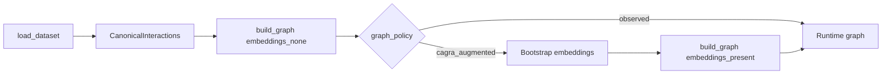

# U-CaGNN Data Pipeline

Use this file for the live data contract: loader registry, canonical interactions, feature policy, graph construction, and sampling.

## Key files

- `.agents/skills/ucagnn-implementation/ucagnn-data-pipeline.md`
- `src/data/loaders/_registry.py`
- `src/data/canonical.py`
- `src/data/feature_policy.py`
- `src/data/graph_builder.py`
- `src/data/subgraph_sampler.py`
- `src/data/negative_sampler.py`
- `src/utils/csv_features.py`
- `src/utils/interaction_indexing.py`

## Runtime path

The diagram shows the runtime boundary: the loader always produces `CanonicalInteractions`, the first graph build always creates the observed train-interaction graph, and the `cagra_augmented` path uses that observed graph only to bootstrap embeddings before rebuilding with added ANN edges.

## Loader boundary

- `load_dataset(...)` is the public loader surface.
- Default preprocessing presets are resolved in `src/data/loaders/_registry.py`.
- Full loads are uncached. Capped loads (`max_rows` set) are cached in-process so tiny validation can reuse the same canonical dataset.
- `feature_policy` and `preprocessing_preset` cross the same loader boundary as the dataset name. A preprocessing preset may own a stricter or broader feature policy; the registry resolves that before calling the concrete loader.

### Repository preprocessing defaults

| Dataset | Default preset | Important alternatives |
| --- | --- | --- |
| `movielens1m` | `movielens_explicit` | none |
| `movielens20m` | `movielens_explicit` | `movielens_explicit_dense_genome` |
| `taobao` | `taobao_multibehavior` | `taobao_multibehavior_raw` |
| `kuairec_v2` | `kuairec_watchratio` | `kuairec_watchratio_raw`, `kuairec_fullobs` |
| `amazonbook` | `amazonbook_graph_only` | none |
| `kuairand1k` | `kuairand_causal` | `kuairand_random_only` |

`kuairec_watchratio` is the default KuaiRec view and uses `big_matrix`. `kuairec_fullobs` remains available as an explicit `small_matrix` comparison path. The preprocessing preset is the semantic source of truth for KuaiRec matrix selection; direct `matrix_variant=...` calls are kept only for loader compatibility and must not conflict with an explicit preset.

## `CanonicalInteractions`

| Group | Fields |
| --- | --- |
| Core arrays | `user_id`, `item_id`, `label`, `timestamp`, `sign`, `popularity` |
| Maps and sizes | `n_users`, `n_items`, `user_map`, `item_map` |
| Optional side info | `user_features`, `item_features` |
| Causal descriptors | `raw_target`, `behavior_type`, `exposure_flag`, `source_domain`, `feedback_type`, `preprocessing_preset` |
| Repeat-collapse summaries | `repeat_count`, `repeat_*`, optional `repeat_behavior_counts`, `repeat_behavior_labels` |
| Split metadata | optional `train_mask`, `val_mask`, `test_mask`, plus `metadata` |
| Propensity supervision | optional `item_propensity_targets` with shape `(n_items,)` |

`get_splits()` prefers predefined loader masks, otherwise derives validation from an existing train/test split, otherwise falls back to the configured derived split mode. `compute_item_recency()` is intended to run on the training split only, and every train-derived runtime summary reuses that same split mask instead of creating category-specific train/test variants.

Repeated raw user-item pairs are collapsed before split derivation for loaders that need one pair to belong to only one split. The retained row is selected by maximum priority with timestamp as a tie-breaker, while `repeat_count`, `repeat_mean_target`, `repeat_max_target`, `repeat_latest_target`, and first/last timestamps preserve the discarded observations in the retained-row encounter order.

`sample_canonical_interactions()` is the canonical owner for tiny-run interaction sampling. It preserves split coverage, remaps sampled user/item IDs, recomputes sampled popularity, and slices every interaction-, user-, and item-aligned canonical field, including repeat summaries, features, metadata arrays, and item-level propensity targets.

## Feature policy

- `thesis_default` loads only safe pre-treatment features from the structured registry.
- `all_optional` keeps exploratory sources such as proxy-only feature files.
- Post-treatment aggregates stay out of thesis-default model features.
- Under `thesis_default`, KuaiRand's `video_features_statistic_1k.csv` stays excluded from model features, but its `show_cnt` column is reused separately as a propensity calibration target.
- Free-text or comment-style columns are not part of the live thesis-default path; the runtime uses only structured numeric, temporal, and categorical-safe features.

`src/utils/csv_features.py` applies one shared encoding policy:

- repeated entity rows are collapsed to the first source row before encoding, so daily feature files cannot let later rows overwrite the thesis-default static item descriptor or influence categorical/min-max scaling,
- numeric and temporal columns are min-max scaled to `[0, 1]` within the loaded source,
- categorical-like columns become deterministic codes in `[0, 1]` with `0` reserved for missing values,
- embedding-time feature buffers are normalized again before the context head, so custom loader features cannot reintroduce raw timestamp or ID scale.

## Graph construction

| `graph_policy` | Path | Current behavior |
| --- | --- | --- |
| `observed` | `load_runtime_data()` -> `build_graph(..., embeddings=None)` | Uses only train-split interaction edges. |
| `cagra_augmented` | `load_runtime_data()` -> bootstrap embeddings -> `build_graph(..., embeddings=...)` | Keeps observed train edges and adds neutral ANN edges from CAGRA. |

Current graph rules:

- `build_graph()` attaches original observed split masks plus label-aware `*_positive_mask` fields.
- Interaction graph edges, BPR training positives, and train-time popularity use only positive training labels.
- Original observed masks remain available for seen-item exclusion and split bookkeeping.
- `build_graph()` always recomputes `data.popularity` from positive rows in the final training split.
- `build_graph()` precomputes `data.edge_norm` once, so training and evaluation share the same degree normalization.
- Optional canonical payloads are copied onto the PyG `Data` object through one shared boundary helper.
- `cagra_augmented` is strict: it requires item features and raises on CAGRA failures instead of silently degrading.

## Train-derived user history and exposure context

- `build_recent_train_history()` creates `recent_train_items` and `recent_train_mask` from the final training split only.
- Those buffers are per-user histories: the latest training interactions for each user, never global "recent" or popularity-only items.
- Subgraph training reuses the same train-derived user history and does not create separate splits for interest, recency, or context.

Only KuaiRand-1K currently populates `item_propensity_targets`, using log1p-normalized `show_cnt` as an exposure proxy. Every other dataset leaves that field as `None`. Because `show_cnt` is a post-treatment aggregate, the context scorer zero-fills the exposure-proxy slot unless calibrated IPW is explicitly enabled (`use_ipw=True` with positive propensity calibration weight). IPW is not enabled by default; it requires an explicit calibrated propensity objective.

## Sampling

- `NegativeSampler` is vectorized and mixes uniform and popularity-weighted draws via `hard_negative_ratio`.
- It receives train-positive `(user, item)` pairs from `TrainerRuntime` and filters sampled negatives against every known positive training item for the same user, not only the current positive item.
- With `negative_sampling_strategy="dice"`, `sample_with_metadata()` also returns the DICE high-popularity mask aligned to each sampled negative. For large-batch U-CaGNN it applies DICE high/low pool routing first, then uses vectorized collision filtering to reject known train positives; `dice_paper` keeps the exact per-user positive-count correction because its paper-owned batch size is small. The mask is consumed directly by `LossSuite`; threshold reconstruction is only a fallback for older/manual payloads.
- `SubgraphSampler` extracts sampled k-hop subgraphs with per-hop fan-out limits from `num_neighbors`.
- `SubgraphBatch` carries:
  - `sub_edge_index`, `sub_edge_sign`, `sub_edge_norm`,
  - global user and item ids for metadata lookup,
  - local user, positive-item, and negative-item ids for scoring and loss computation,
  - optional `dice_negative_mask` batch metadata for DICE-style branch losses.
