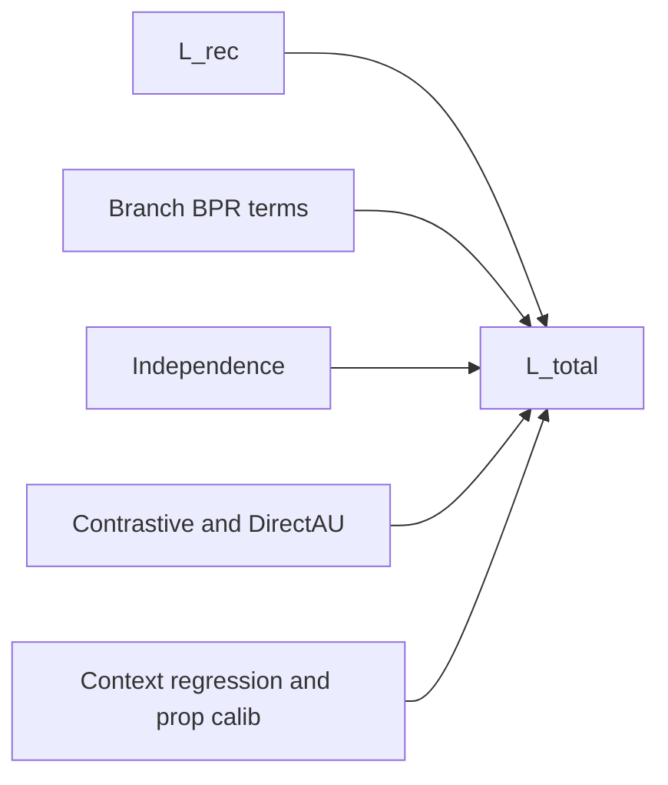

# U-CaGNN Losses

Use this file for the live objective contract. `LossSuite` is the only public loss-layer surface.

## Key files

- `.agents/skills/ucagnn-implementation/ucagnn-losses.md`
- `src/losses/loss_suite.py`
- `src/models/ucagnn.py`
- `src/training/mini_batch_trainer.py`
- `experiments/ablation_configs.py`

## Loss composition



Diagram scope: weighted-sum structure only. Activation depends on preset, config weight, payload tensors, and schedule.

## Loss terms

| Term | Source tensors | Base weight | Enabled when |
| --- | --- | --- | --- |
| `L_rec` | Calibrated `final_score(pos)` vs `final_score(neg)`, or raw branch `interest+conformity` when `recommendation_loss_mode="dice_sum"` | `loss_weight_recommendation = 1.0` | Always on; IPW-reweighted only when `use_ipw=True`, propensity calibration is weighted, and batch propensity targets exist |
| `L_interest_bpr` | Raw `branch_interest_score` when present, otherwise `interest_score`; symmetric branch BPR, or DICE popular-negative masked BPR when `branch_loss_mode="dice"` | `0.02` for U-CaGNN, `0.1` for GCN-DICE | Dual-branch only |
| `L_conformity_bpr` | Raw `branch_conformity_score` when present, otherwise `conformity_score`; symmetric branch BPR, or DICE popularity BPR with reversed direction for popular negatives when `branch_loss_mode="dice"` | `0.02` for U-CaGNN, `0.1` for GCN-DICE | Dual-branch only |
| `L_independence` | Cosine-squared branch decorrelation, or distance-correlation discrepancy when `branch_loss_mode="dice"` | `0.005` for U-CaGNN, `0.01` for GCN-DICE | Dual-branch only |
| `L_contrastive` | Branch-local positive-pair contrastive terms | `0.02` | Dual-branch only and weight > 0; weights are applied outside the log-probability |
| `L_align` / `L_uniform` | DirectAU-style branch geometry | `0.02` | Dual-branch only and weight > 0 |
| `L_pop` | Raw `raw_context_score(pos)` when present, otherwise `context_score(pos)`, vs train-split item popularity target | `0.02` | Dual branch + context head + weight > 0 |
| `L_prop_calib` | `propensity_scores(pos)` vs `propensity_targets(pos)` | `0.0` | Weight > 0 and batch propensity targets available |
| `L_embedding_reg` | LightGCN initial user, positive-item, and negative-item embeddings | `weight_decay=1e-4` for `lightgcn_paper` | `baseline_family="lightgcn_paper"` only |

## Total objective

```text
L_total =
    loss_weight_recommendation * L_rec
  + interest_weight * L_interest_bpr
  + conformity_weight * L_conformity_bpr
  + independence_weight * L_independence
  + contrastive_weight * L_contrastive
  + align_weight * L_align
  + uniform_weight * L_uniform
  + popularity_weight * L_pop
  + prop_calib_weight * L_prop_calib
  + weight_decay * L_embedding_reg
```

Implementation facts:

| Area | Contract |
| --- | --- |
| weight resolution | `LossSuite` resolves effective auxiliary weights before summing |
| fp32 terms | `L_rec`, `L_pop`, `L_prop_calib` |
| U-CaGNN recommendation score | calibrated fused `final_score` |
| branch supervision | raw branch scores |
| context supervision | raw `raw_context_score` when available |
| contrastive | normalize branch embeddings; detached row weights after log-probability |

When `branch_loss_mode="dice"`, the branch terms follow DICE semantics:

| Item | Contract |
| --- | --- |
| sampler mask | `dice_negative_mask` marks popularity-dominated negatives |
| mask consumer | `LossSuite`; fallback reconstructs from train popularity + `dice_branch_margin` |
| mask reduction | `dice_mask_reduction="batch_mean"` averages masked loss over the full batch; `active_mean` divides by active mask count |
| margin owner | `dice_paper` and `ucagnn` lock fallback margin to `dice_sampler_margin` |
| margin decay | only when `dice_adaptive_decay=True` |
| `L_interest_bpr` | active only on popularity-dominated negatives |
| `L_conformity_bpr` | popular negative above positive; otherwise positive above negative |
| `L_independence` scope | unique active users + unique positive/negative items |
| DICE match | mirrors `torch.unique(user)` / `torch.unique(item_p,item_n)` scope |
| distance cap | deterministic hash sample up to `distance_correlation_max_pairs` |
| `L_uniform` | `torch.pdist` on hash-sampled rows up to `uniformity_max_pairs` |
| `L_align` | all aligned positive pairs; linear in batch size |
| `dice_paper` rec score | `recommendation_loss_mode="dice_sum"` uses `interest_score + conformity_score` |

## Schedule semantics

| Schedule | Current behavior |
| --- | --- |
| `phased` | Branch BPR active epoch 0; regularizers wait for `auxiliary_losses_start_epoch`; context/calib wait for `popularity_supervision_start_epoch`. |
| `linear_ramp` | Branch BPR active epoch 0; regularizers/side tasks ramp from 0; `auxiliary_losses_start_epoch` does not delay ramp. |

Ramp rates:

| Term group | Rate |
| --- | --- |
| `L_independence` | `independence_ramp_rate` |
| `L_contrastive`, `L_align`, `L_uniform`, `L_pop`, `L_prop_calib` | `auxiliary_ramp_rate` |

`preset_full()` uses `linear_ramp`; DICE branch BPR is primary supervision, not delayed auxiliary. Non-causal presets keep `phased`; most auxiliary weights are zero.

## Preset-owned defaults

| Preset | Active losses by default |
| --- | --- |
| `lightgcn` preset (`UCaGNNConfig.preset_lightgcn()`) | `L_rec` |
| `dice_like` preset (`UCaGNNConfig.preset_dice_like()`) | `L_rec + L_interest_bpr + L_conformity_bpr + L_independence` |
| `lightgcn_paper` preset (`UCaGNNConfig.preset_lightgcn_paper()`) | `L_rec + explicit ego-embedding L2` with full-graph LightGCN training |
| `dice_paper` preset (`UCaGNNConfig.preset_dice_paper()`) | DICE total BPR + DICE interest/conformity BPR + distance-correlation discrepancy; `dice_mask_reduction="batch_mean"` for paper-faithful scale |
| `ucagnn` preset (`UCaGNNConfig.preset_full()`) | `L_rec + DICE-style L_interest_bpr + DICE-style L_conformity_bpr + DICE-style L_independence + L_pop`, trained with DICE-conditioned negatives; `dice_mask_reduction="active_mean"` by default |

In `preset_full()`, contrastive, align, uniform, IPW, and propensity calibration remain implemented but disabled until explicitly turned on.

## Propensity calibration requirements

`L_prop_calib` stays inactive unless all of the following are true:

1. `loss_weight_propensity_calibration > 0`,
2. the model output contains `propensity_scores`,
3. the current batch provides `propensity_targets`.

The data path that supplies those targets is owned by `ucagnn-data-pipeline.md`, while the runtime move and batch slicing are owned by `ucagnn-training.md`.

IPW weights are also gated by the same target availability. This prevents the recommendation loss from using random inverse-propensity weights from an uncalibrated MLP.
