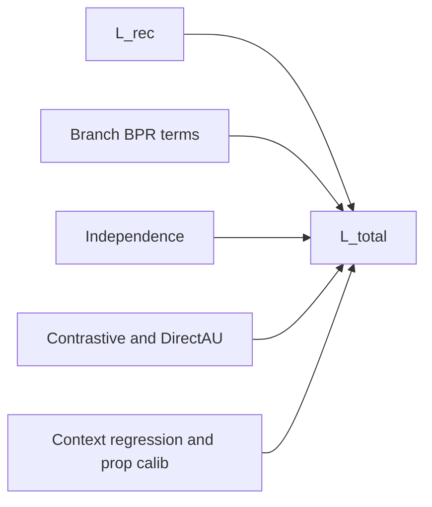

# U-CaGNN Losses

Use this file for the live objective contract. `LossSuite` is the only public loss-layer surface.

## Key files

- `.github/skills/ucagnn-implementation/ucagnn-losses.md`
- `src/losses/loss_suite.py`
- `src/models/ucagnn.py`
- `src/training/mini_batch_trainer.py`
- `experiments/ablation_configs.py`

## Loss composition



The diagram shows the weighted-sum structure only. Whether a term contributes in a given run depends on the preset, the corresponding config weight, and the schedule rules below.

## Loss terms

| Term | Source tensors | Base weight | Enabled when |
| --- | --- | --- | --- |
| `L_rec` | `final_score(pos)` vs `final_score(neg)`, or `interest+conformity` when `recommendation_loss_mode="dice_sum"` | `loss_weight_recommendation = 1.0` | Always on; IPW-reweighted only when `use_ipw=True`, propensity calibration is weighted, and batch propensity targets exist |
| `L_interest_bpr` | Symmetric branch BPR, or DICE popular-negative masked BPR when `branch_loss_mode="dice"` | `0.02` for U-CaGNN, `0.1` for GCN-DICE | Dual-branch only |
| `L_conformity_bpr` | Symmetric branch BPR, or DICE popularity BPR with reversed direction for popular negatives when `branch_loss_mode="dice"` | `0.02` for U-CaGNN, `0.1` for GCN-DICE | Dual-branch only |
| `L_independence` | Cosine-squared branch decorrelation, or distance-correlation discrepancy when `branch_loss_mode="dice"` | `0.005` for U-CaGNN, `0.01` for GCN-DICE | Dual-branch only |
| `L_contrastive` | Branch-local positive-pair contrastive terms | `0.02` | Dual-branch only and weight > 0; weights are applied outside the log-probability |
| `L_align` / `L_uniform` | DirectAU-style branch geometry | `0.02` | Dual-branch only and weight > 0 |
| `L_pop` | `context_score(pos)` vs train-split item popularity target | `0.02` | Dual branch + context head + weight > 0 |
| `L_prop_calib` | `propensity_scores(pos)` vs `propensity_targets(pos)` | `0.0` | Weight > 0 and batch propensity targets available |
| `L_embedding_reg` | LightGCN initial user, positive-item, and negative-item embeddings | `weight_decay=1e-4` for `lightgcn_paper` | `baseline_family="lightgcn_paper"` only |

## Total objective

```text
L_total =
    loss_weight_recommendation * L_rec
  + interest_weight * L_interest_bpr
  + conformity_weight * L_conformity_bpr
  + independence_weight * L_independence
  + contrastive_weight * L_contrastive
  + align_weight * L_align
  + uniform_weight * L_uniform
  + popularity_weight * L_pop
  + prop_calib_weight * L_prop_calib
  + weight_decay * L_embedding_reg
```

`LossSuite` resolves the effective auxiliary weights first, then applies this weighted sum.

`L_rec`, `L_pop`, and `L_prop_calib` are computed in fp32 so AMP does not change the loss scale. Contrastive branches normalize embeddings before their dot products and apply detached row weights after the log-probability.

When `branch_loss_mode="dice"`, the branch terms follow DICE semantics:

- the DICE sampler returns a `dice_negative_mask` that marks popularity-dominated negatives; `LossSuite` consumes that mask directly, and only reconstructs it from train-only popularity plus `dice_branch_margin` when a manual/legacy payload omits the sampler metadata,
- for `dice_paper` and `ucagnn`, the sampler and fallback branch margin are locked to `dice_sampler_margin`, and the margin decays with `dice_margin_decay` only when `dice_adaptive_decay=True`,
- `L_interest_bpr` is applied only on those popularity-dominated negatives,
- `L_conformity_bpr` ranks the more popular negative above the positive for popularity-dominated pairs and ranks the positive above less-popular negatives otherwise,
- `L_independence` uses distance correlation over the unique active users and unique positive/negative items from the batch, matching external DICE's `torch.unique(user)` / `torch.unique(item_p,item_n)` discrepancy scope instead of overweighting repeated negative-expanded rows,
- `dice_paper` uses `recommendation_loss_mode="dice_sum"` so the recommendation BPR is computed on `interest_score + conformity_score`, matching the DICE total score.

## Schedule semantics

| Schedule | Current behavior |
| --- | --- |
| `phased` | `L_interest_bpr` and `L_conformity_bpr` are active from epoch 0; `L_independence`, `L_contrastive`, `L_align`, and `L_uniform` wait for `auxiliary_losses_start_epoch`; `L_pop` and `L_prop_calib` wait for `popularity_supervision_start_epoch`. |
| `linear_ramp` | `L_interest_bpr` and `L_conformity_bpr` stay active at their configured weights from epoch 0. The schedule ramps regularization/side-task auxiliaries from 0 toward their configured max weights: `L_independence` uses `independence_ramp_rate`; `L_contrastive`, `L_align`, `L_uniform`, `L_pop`, and `L_prop_calib` use `auxiliary_ramp_rate`. Under `linear_ramp`, `auxiliary_losses_start_epoch` does **not** delay the ramp itself. |

`preset_full()` uses `linear_ramp`, but DICE branch BPR is primary causal supervision rather than a delayed auxiliary. The non-causal presets keep `phased`, but most auxiliary weights are zero there anyway.

## Preset-owned defaults

| Preset | Active losses by default |
| --- | --- |
| `lightgcn` preset (`UCaGNNConfig.preset_lightgcn()`) | `L_rec` |
| `dice_like` preset (`UCaGNNConfig.preset_dice_like()`) | `L_rec + L_interest_bpr + L_conformity_bpr + L_independence` |
| `lightgcn_paper` preset (`UCaGNNConfig.preset_lightgcn_paper()`) | `L_rec + explicit ego-embedding L2` with full-graph LightGCN training |
| `dice_paper` preset (`UCaGNNConfig.preset_dice_paper()`) | DICE total BPR + DICE interest/conformity BPR + distance-correlation discrepancy |
| `ucagnn` preset (`UCaGNNConfig.preset_full()`) | `L_rec + DICE-style L_interest_bpr + DICE-style L_conformity_bpr + DICE-style L_independence + L_pop`, trained with DICE-conditioned negatives |

In `preset_full()`, contrastive, align, uniform, IPW, and propensity calibration remain implemented but disabled until explicitly turned on.

## Propensity calibration requirements

`L_prop_calib` stays inactive unless all of the following are true:

1. `loss_weight_propensity_calibration > 0`,
2. the model output contains `propensity_scores`,
3. the current batch provides `propensity_targets`.

The data path that supplies those targets is owned by `ucagnn-data-pipeline.md`, while the runtime move and batch slicing are owned by `ucagnn-training.md`.

IPW weights are also gated by the same target availability. This prevents the recommendation loss from using random inverse-propensity weights from an uncalibrated MLP.
