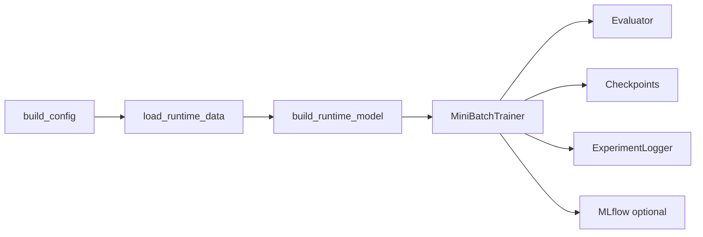

# U-CaGNN Training

Use this file for the live runtime path: trainer setup, evaluation, checkpoint identity, and experiment tracking.

## Key files

- `.agents/skills/ucagnn-implementation/ucagnn-training.md`
- `src/utils/trainer_runtime.py`
- `src/training/mini_batch_trainer.py`
- `src/training/evaluator.py`
- `src/profiling/gpu_profiler.py`
- `src/utils/experiment_logger.py`
- `experiments/run_experiment.py`
- `experiments/run_benchmark.py`
- `experiments/cli_parsers.py`

## Runtime flow

The diagram shows the single-run path: config resolution, data and graph load, model construction, sampled-subgraph or full-graph training, full-graph evaluation, and tracking. The benchmark and ablation entry points reuse the same runtime pieces.

## Supported entry points

| Command | Current role |
| --- | --- |
| `uv run experiment` | One explicit run. |
| `uv run ablation` | Thesis-facing ablation sweep over named variants. |
| `uv run formal-run` | Profile-driven formal matrix with strict resume state; accepts comma-separated profile queues. |
| `uv run quick-validate` | Fixed smoke suite over the shared runtime path. |

The public CLIs are intentionally selection-focused. Recipes, presets, ablation variants, and formal profiles own the training semantics.

## Runtime responsibilities

1. `build_config()` resolves one `UCaGNNConfig`.
2. `load_runtime_data()` loads the canonical dataset and builds the requested graph policy.
3. `build_runtime_model()` instantiates explicit paper adapters for `lightgcn_paper` and `dice_paper`; otherwise it derives item recency and per-user recent-train histories from `data.train_mask`, converts any canonical propensity targets to tensors, and instantiates `UCaGNN`.
4. `run_experiment()` attaches optional `data.propensity_targets`, resolves auto batch size, and builds checkpoint identities.
5. `MiniBatchTrainer.train()` runs sampled-subgraph training from `data.train_positive_mask` when `training_graph_mode="sampled"` and full-graph propagation per optimizer step when `training_graph_mode="full"`.
6. `Evaluator.evaluate()` runs full-graph evaluation from one propagated full-graph state and treats only `labels > 0` rows as relevant.
7. `ExperimentLogger` writes SQLite records; MLflow mirrors runs when enabled.

## `TrainerRuntime`

`TrainerRuntime` owns:

- device setup and shared move helpers,
- optimizer construction: U-CaGNN uses AdamW with fused CUDA kernels when available; `lightgcn_paper` uses Adam plus explicit LightGCN embedding L2 in the loss; `dice_paper` uses Adam with DICE's `(0.5, 0.99)` betas and AMSGrad,
- default CUDA AMP (`bfloat16` on CUDA),
- optional EMA state,
- scheduler and early-stopping state,
- checkpoint save and load,
- cached `popularity` and optional `propensity_targets`,
- cached raw train-only `popularity_count` for DICE-style branch masks and negative sampling,
- evaluator construction and shared logging hooks.

Important runtime details:

- the experiment runner sets `PYTORCH_ALLOC_CONF=expandable_segments:True` before importing `torch` unless the user already configured a CUDA allocator policy, and it accepts the legacy `PYTORCH_CUDA_ALLOC_CONF` alias as the source value when present,
- sign-aware scalars (`alpha_pos`, `alpha_neg`) live in a zero-weight-decay optimizer group,
- `use_torch_compile` is opt-in because sampled subgraphs are too dynamic for a default compile win,
- best validation state is tracked even when `use_early_stopping=False`,
- validation retries once on CUDA after optimizer-state offload, then falls back to CPU if evaluation still OOMs,
- a late auto-batch training OOM releases the failed trainer and resumes the next smaller candidate from the latest completed-epoch checkpoint when one exists,
- auto-batch probe, verification, and training-fallback OOM logs include the original exception summary plus PyTorch CUDA allocated, reserved, peak-allocated, and peak-reserved memory; probe OOMs also annotate the failing stage and sampled-subgraph dimensions when a subgraph had already been prepared,
- scheduler stepping and early-stopping patience both wait until `max(auxiliary_losses_start_epoch, popularity_supervision_start_epoch)`.
- training interaction tensors use `data.train_positive_mask` when present, falling back to `train_mask & labels > 0`.

## `MiniBatchTrainer`

`MiniBatchTrainer` is the only trainer.

- In sampled mode, on CUDA it first tries to stage the full graph into a CUDA-resident `SubgraphSampler`.
- If sampled graph staging or later batch preparation reports a CUDA OOM, including plain RuntimeError messages from CUDA kernels, it falls back to the CPU sampler path.
- Sampled BFS uses bounded CSR offset gathers for each hop, so expansion memory scales with `frontier_size * num_neighbors[hop]` instead of the frontier's total incident degree.
- U-CaGNN sampled-subgraph propagation builds uncoalesced CUDA sparse COO tensors, with CPU chunked edge-list fallback, instead of coalescing a sparse COO tensor every batch; this avoids large temporary sort/workspace allocations while keeping GPU propagation kernelized.
- In full-graph mode, it bypasses subgraph extraction and calls the model with the full train graph for every optimizer step. This mode is used by `lightgcn_paper` and `dice_paper`.
- Full-graph mode stages `edge_index`, `edge_sign`, and `edge_norm` once per trainer/device instead of copying graph tensors every batch, then releases the CUDA graph cache before validation to avoid duplicating evaluator graph memory.
- `lightgcn_paper` is backed by `PaperLightGCN`: no dropout, no side features, no learned score mixer, observed graph only, Adam optimizer, and explicit ego-embedding L2 regularization.
- `dice_paper` is backed by `PaperGCNDICE`: separate interest/conformity embedding tables, DICE self-looped LightGCN backbone propagation, DICE dropout, and summed interest+conformity final scores.
- `negative_sampling_strategy="dice"` uses DICE popularity-conditioned negative pools with raw train-only item counts, `dice_sampler_margin`, and `dice_sampler_pool`. `dice_paper` keeps the external-code `n_negatives=4` and exact per-user pool-count correction; `ucagnn` uses `n_negatives=1` plus vectorized known-positive collision filtering to keep sampled-subgraph cost close to standard BPR while still training on DICE-conditioned negatives.
- Sampled and full-graph training both pass the current epoch into the negative sampler. The DICE sampler margin decays only when `dice_adaptive_decay=True`.
- CPU-prepared `SubgraphBatch` objects are pinned and copied with `non_blocking=True`.
- Batch-local auxiliary losses operate on the batch users and selected positive items, not the full sampled frontier.
- The trainer slices local normalized popularity, local raw branch popularity, and local propensity targets by `sub_batch.item_global_ids` before calling `LossSuite`.
- DEBUG logging emits batch loss components plus IPW, propensity-target, and score summaries for the sampled batch.

## Evaluator

`Evaluator` computes the thesis-primary PyG metric bundle:

- `NDCG@20`
- `Recall@20`
- `AveragePopularity@20`
- `HitRatio@20`
- `Personalization@20`
- `NDCG@40`
- `Recall@40`
- `AveragePopularity@40`
- `HitRatio@40`
- `Personalization@40`

Current evaluation rules:

- relevance ground truth is `target_mask & labels > 0`; non-positive observed rows are never counted as relevant,
- validation excludes training interactions only,
- test excludes both training and validation interactions, including when the caller passes an equivalent copied test mask,
- full-graph propagation happens once per evaluation call,
- validation logs only the thesis-primary metrics; refined scorer diagnostics are reserved for the final post-training test pass,
- evaluator batch sizing keeps the 512 MiB score-matrix cap split-aware and budgets extra headroom when refined-score component export materializes the interest, conformity, context, and final full-catalog views,
- refined scorer diagnostics reuse the same propagated batch state and top-k recommendations as thesis ranking metrics, and gather native-dtype top-k slices before float accumulation math,
- diagnostics append `score_mix_*` summary stats, weighted branch contributions at `@20/@40`, interest-vs-conformity cosine checks, and per-component popularity Spearman when the model exports those components on the final test pass,
- dual-branch final-test diagnostics also evaluate standalone raw interest/conformity branch rankers with PyG-standard `NDCG`, `Recall`, and `AveragePopularity` at `@20/@40`; these are diagnostic evidence for branch behavior, not extra primary thesis metrics,
- do not add custom paper-nonstandard ranking outputs unless a paper-faithful definition is implemented and explicitly justified; default thesis outputs should stay with PyG-standard metrics and easy-to-interpret diagnostics,
- split-specific ground-truth and exclusion dictionaries are cached by mask identity,
- `cagra_candidate_k` optionally restricts scoring to ANN candidates on CUDA.

Quick validation uses larger tiny caps for sparse-positive Taobao and KuaiRand slices so label-aware validation/test splits contain positive targets.

`cagra_candidate_k` is evaluation-only. It is separate from `graph_policy="cagra_augmented"`, which changes the training graph itself.

## Checkpoints and identity

| Identity | Purpose |
| --- | --- |
| `training_identity` / `training_hash` | Resume compatibility and checkpoint path identity |
| `evaluation_identity` / `evaluation_hash` | Same-checkpoint metric comparability |

Current rules:

- the default checkpoint filename includes `training_hash`,
- changing a training-defining field requires a new checkpoint,
- evaluation-only changes such as `eval_ks` may reuse the same checkpoint,
- `--overwrite-checkpoint` deletes the resolved checkpoint before a fresh run starts.

## Experiment tracking

- **SQLite is primary.** `ExperimentLogger` stores configs, metrics, profiling data, hashes, and provenance in `results/thesis_experiments.db`.
- **MLflow is secondary.** It mirrors runs and artifacts but is not the source of truth.
- evaluator diagnostics go through the same metric logging path as thesis metrics; no parallel diagnostics store exists.
- `formal-run` persists `results/formal_run_state.json` as a strict resume pointer, not as a profile definition. When `--profile` contains a comma-separated list, profiles run sequentially and the state file tracks the active/latest profile.
- runtime-probe profiles keep `config_overrides.epochs=1` and store their full-run estimate target in profile-level `runtime_probe.target_epochs`; after a probe completes, `experiments/run_benchmark.py` logs estimated full training time, remaining time, seconds per epoch, batches per epoch, and batch/s under the SQLite `approximation` split.
- Per-epoch training-window resources are logged when available: `gpu_utilization_pct` stores the average training GPU utilization for the epoch, `max_gpu_utilization_pct` stores the peak sampled training utilization, `train_peak_vram_allocated_mb` / `train_peak_vram_reserved_mb` store PyTorch allocator peaks, `train_peak_gpu_memory_used_mb` stores the peak `nvidia-smi memory.used` sample, and legacy `peak_vram_mb` uses the training `nvidia-smi` peak when available with PyTorch allocated peak as fallback.
- Canonical experiment names are shared by runtime checkpointing and `query-results` through `src/utils/experiment_naming.py`.
- Query surfaces are centralized in `ExperimentLogger.VIEW_TABLES`, which powers the `completed`, `attention`, `errors`, and `comparison` views used by `scripts/query_results.py`.
- The default `query-results` thesis summary keeps CRRU inline: it prints a short Composite Resource-aware Recommendation Utility framing block, reports dataset-local section-row `CRRU@20` and `CRRU@40`, separates final formal thesis profiles from supporting historical/preprocessing-sweep rows, excludes runtime probes from ranking sections, reports currently supported public ablation variants separately, notes that CRRU is not a causal-effect estimator, and does not emit a separate CRRU table.
