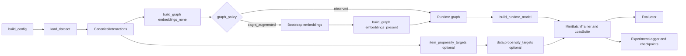

# U-CaGNN Implementation Overview

Integration map only. Use owner docs for details. Keep this file dense and non-duplicative.

## Reading map

| Need | Open |
| --- | --- |
| model modules and refined scorer | `ucagnn-architecture.md` |
| loaders, canonical schema, graph build, samplers | `ucagnn-data-pipeline.md` |
| presets and config rules | `ucagnn-config.md` |
| objectives and schedule semantics | `ucagnn-losses.md` |
| runtime flow, evaluator, checkpoints, logging | `ucagnn-training.md` |

## End-to-end flow

Owner pointers:

| Topic | Owner |
| --- | --- |
| config precedence, presets, profiles, search spaces | `ucagnn-config.md` |
| graph policy, feature policy, propensity target loading | `ucagnn-data-pipeline.md` |
| scoring modules, score fusion, propensity scorer gates | `ucagnn-architecture.md` |
| loss activation, DICE losses, IPW/calibration gates | `ucagnn-losses.md` |
| checkpointing, auto-batch, evaluator, logging, reports | `ucagnn-training.md` |

Runtime invariants:

| Area | Current invariant |
| --- | --- |
| validation loop | thesis-primary metrics only; refined diagnostics off |
| final test | refined scorer diagnostics on when supported |
| branch diagnostics | standalone raw interest/conformity rankers are diagnostics only |
| finished recovery | evaluate best validation state, not latest epoch state |
| auto-batch recovery | check saved candidate identities before CUDA probing |
| OOM logging | exception summary + allocator stats + probe/subgraph context when available |
| telemetry window | training-only GPU utilization and VRAM before validation/test |
| CUDA allocator | set `PYTORCH_ALLOC_CONF=expandable_segments:True` unless user configured it |
| DICE independence | hash-sample entities up to `distance_correlation_max_pairs` |
| DirectAU uniformity | hash-sample rows up to `uniformity_max_pairs` |
| sampled BFS | bounded CSR offset gathers by hop fanout |
| U-CaGNN propagation | uncoalesced CUDA sparse COO; CPU chunked edge-list fallback |
| U-CaGNN DICE negatives | fast high/low routing + vectorized known-positive filtering |
| `dice_paper` negatives | exact per-user pool-count correction retained |

## Source map

| Path | Responsibility |
| --- | --- |
| `src/utils/config.py` | `UCaGNNConfig` defaults, validation, preset overrides |
| `experiments/experiment_catalog.json` | formal profiles and runtime probes |
| `experiments/search_spaces.json` | declarative Optuna search spaces |
| `experiments/recipes.py` | profile/search-space loading and override resolution |
| `experiments/benchmark_resolvers.py` | formal/search sweep normalization helpers |
| `src/utils/experiment_naming.py` | shared canonical experiment names for checkpoints and result reports |
| `src/data/loaders/_registry.py` | dataset registry and default preprocessing presets |
| `src/data/canonical.py` | canonical interaction schema, split logic, tiny-run sampling, item recency |
| `src/data/feature_policy.py` | safe-vs-optional feature registry |
| `src/data/graph_builder.py` | graph construction, optional field transfer, train-only popularity, CAGRA augmentation |
| `src/data/subgraph_sampler.py` | sampled k-hop subgraph extraction |
| `src/data/negative_sampler.py` | vectorized negative sampling |
| `src/models/common.py` | shared model helpers and training payload packaging |
| `src/models/embeddings.py` | embedding layer |
| `src/models/lightgcn.py` | propagation layer |
| `src/models/baselines/lightgcn.py` | canonical paper LightGCN adapter |
| `src/models/baselines/dice.py` | canonical paper GCN-DICE adapter |
| `src/models/scoring.py` | scoring layer |
| `src/models/propensity.py` | propensity layer |
| `src/models/ucagnn.py` | model orchestration and public train/eval surfaces |
| `src/losses/loss_suite.py` | total objective assembly |
| `src/utils/trainer_runtime.py` | shared runtime, optimizer, scheduler, checkpointing |
| `src/training/mini_batch_trainer.py` | sole trainer |
| `src/training/evaluator.py` | batched full-graph evaluation |
| `experiments/run_experiment.py` | single-run orchestration and runtime assembly |
| `experiments/run_benchmark.py` | formal-run orchestration and strict saved-state handling |
| `experiments/run_search.py` | Optuna search controller |
| `experiments/ablation_configs.py` | thesis-facing ablation variants |
| `src/utils/experiment_logger.py` | SQLite experiment store |
| `src/utils/crru.py` | CRRU and online-validation CRRU utilities |
| `scripts/query_results.py` | SQLite-first result inspection |
| `scripts/quick_validate.py` | smoke validation entry point |
