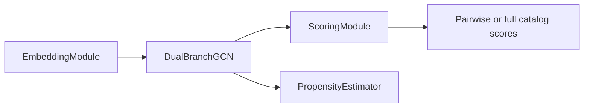

# U-CaGNN Architecture

Use this file for the live model structure: embeddings, propagation, scoring, and the public `UCaGNN` surfaces used by training and evaluation.

## Key files

- `.github/skills/ucagnn-implementation/ucagnn-architecture.md`
- `src/models/embeddings.py`
- `src/models/lightgcn.py`
- `src/models/scoring.py`
- `src/models/propensity.py`
- `src/models/ucagnn.py`

## Model path

The diagram shows the runtime path: the embedding layer prepares tables and metadata, the propagation layer updates them over the graph, the scoring layer produces ranking scores, and the optional propensity layer produces item-side propensity scores for IPW.

## Component responsibilities

| Layer | Owner | Current contract |
| --- | --- | --- |
| Embedding layer | `EmbeddingModule` | Builds user and item embeddings, optional popularity embeddings, train-split metadata buffers, and optional item-feature fusion inputs. |
| Propagation layer | `DualBranchGCN` | Runs sparse LightGCN propagation with explicit branch depths and optional sign-aware edge weights. |
| Scoring layer | `ScoringModule` | Produces pairwise and full-catalog component scores plus the fused final score for the active score view. |
| Propensity layer | `PropensityEstimator` | Optional two-layer MLP over propagated item embeddings, clipped to `[propensity_clip_min, propensity_clip_max]`. |
| Orchestrator | `UCaGNN` | Wires the embedding, propagation, scoring, and optional propensity layers together for subgraph training and full-graph evaluation. |

## Embedding and propagation rules

- `single_branch_gnn_layers` controls the single-branch path. `interest_gnn_layers` and `conformity_gnn_layers` control the dual-branch path.
- When `use_features=True` and `item_features` exist, `EmbeddingModule` projects item features once and builds branch-aware item inputs:
  - `item_interest = item_embed + gate * projected_features`
  - `item_conformity = item_embed + gate * (projected_features * popularity_gate)`
- `item_popularity` and `item_recency` are registered once in the embedding layer and reused by both training and evaluation.
- `LightGCNBranch` uses repeated sparse adjacency matmuls and alpha-averaged layer outputs. Degree normalization comes from precomputed `edge_norm`, so train and eval use the same normalization.
- Sign-aware weighting only changes mixed-sign graphs. Positive and neutral edges keep weight `1.0`; negative edges receive weight `alpha_neg / alpha_pos`, which downweights their propagation effect.

## Score views

| Score view | Meaning |
| --- | --- |
| `default` | Interest + conformity + popularity, masked and weighted by the active scoring mode. |
| `interest_only` | Interest branch only. |
| `conformity_only` | Conformity branch only. |
| `conformity_suppressed` | Interest + popularity, with conformity removed. |

`train_scoring_mode` and `eval_scoring_mode` both default to `default`. The evaluator may reuse the same checkpoint with a different eval-only score view.

## Public `UCaGNN` surfaces

| Method | Used by | Returns |
| --- | --- | --- |
| `forward_subgraph(batch)` | `MiniBatchTrainer` | One training payload for a sampled subgraph batch. |
| `get_propagated_for_eval(edge_index, edge_sign, edge_norm, ...)` | `Evaluator` | One reusable full-graph propagated state. |
| `score_users_from_propagated(propagated, user_ids, ...)` | `Evaluator` | Final `(batch_users, n_items)` score matrix. |
| `get_all_score_components(...)` | diagnostics and same-checkpoint evaluation tooling | Full-catalog component scores plus branch embeddings when dual-branch is active. |
| `build_training_output(...)` | internal training path | Shared payload containing scores, propagated tensors, IPW weights, and optional `propensity_scores`. |
