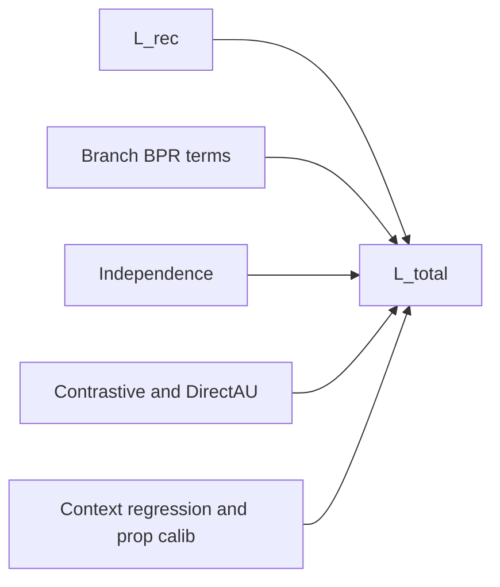

# U-CaGNN Losses

Use this file for the live objective contract. `LossSuite` is the only public loss-layer surface.

## Key files

- `.github/skills/ucagnn-implementation/ucagnn-losses.md`
- `src/losses/loss_suite.py`
- `src/models/ucagnn.py`
- `src/training/mini_batch_trainer.py`
- `experiments/ablation_configs.py`

## Loss composition



The diagram shows the weighted-sum structure only. Whether a term contributes in a given run depends on the preset, the corresponding config weight, and the schedule rules below.

## Loss terms

| Term | Source tensors | Base weight | Enabled when |
| --- | --- | --- | --- |
| `L_rec` | `final_score(pos)` vs `final_score(neg)` | `loss_weight_recommendation = 1.0` | Always on; IPW-reweighted when `use_ipw=True` |
| `L_interest_bpr` | `interest_score(pos)` vs `interest_score(neg)` | `0.02` | Dual-branch only |
| `L_conformity_bpr` | `conformity_score(pos)` vs `conformity_score(neg)` | `0.02` | Dual-branch only |
| `L_independence` | `user_interest` vs `user_conformity` | `0.005` | Dual-branch only |
| `L_contrastive` | Branch-local positive-pair contrastive terms | `0.02` | Dual-branch only and weight > 0 |
| `L_align` / `L_uniform` | DirectAU-style branch geometry | `0.02` | Dual-branch only and weight > 0 |
| `L_pop` | `context_score(pos)` vs train-split item popularity target | `0.02` | Dual branch + context head + weight > 0 |
| `L_prop_calib` | `propensity_scores(pos)` vs `propensity_targets(pos)` | `0.0` | Weight > 0 and batch propensity targets available |

## Total objective

```text
L_total =
    loss_weight_recommendation * L_rec
  + interest_weight * L_interest_bpr
  + conformity_weight * L_conformity_bpr
  + independence_weight * L_independence
  + contrastive_weight * L_contrastive
  + align_weight * L_align
  + uniform_weight * L_uniform
  + popularity_weight * L_pop
  + prop_calib_weight * L_prop_calib
```

`LossSuite` resolves the effective auxiliary weights first, then applies this weighted sum.

## Schedule semantics

| Schedule | Current behavior |
| --- | --- |
| `phased` | `L_interest_bpr` and `L_conformity_bpr` are active from epoch 0; `L_independence`, `L_contrastive`, `L_align`, and `L_uniform` wait for `auxiliary_losses_start_epoch`; `L_pop` and `L_prop_calib` wait for `popularity_supervision_start_epoch`. |
| `linear_ramp` | Every enabled auxiliary ramps from 0 toward its configured max weight. `L_independence` uses `independence_ramp_rate`; the other enabled auxiliaries use `auxiliary_ramp_rate`. Under `linear_ramp`, `auxiliary_losses_start_epoch` does **not** delay the ramp itself. |

`preset_full()` uses `linear_ramp`. The non-causal presets keep `phased`, but most auxiliary weights are zero there anyway.

## Preset-owned defaults

| Preset | Active losses by default |
| --- | --- |
| `lightgcn` preset (`UCaGNNConfig.preset_lightgcn()`) | `L_rec` |
| `dice_like` preset (`UCaGNNConfig.preset_dice_like()`) | `L_rec + L_interest_bpr + L_conformity_bpr + L_independence` |
| `ucagnn` preset (`UCaGNNConfig.preset_full()`) | `L_rec + L_interest_bpr + L_conformity_bpr + L_independence + L_pop` |

In `preset_full()`, contrastive, align, uniform, and propensity calibration remain implemented but disabled until explicitly turned on.

## Propensity calibration requirements

`L_prop_calib` stays inactive unless all of the following are true:

1. `loss_weight_propensity_calibration > 0`,
2. the model output contains `propensity_scores`,
3. the current batch provides `propensity_targets`.

The data path that supplies those targets is owned by `ucagnn-data-pipeline.md`, while the runtime move and batch slicing are owned by `ucagnn-training.md`.
