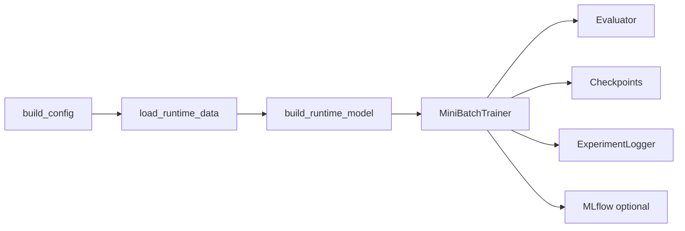

# U-CaGNN Training

Use this file for the live runtime path: trainer setup, evaluation, checkpoint identity, and experiment tracking.

## Key files

- `.github/skills/ucagnn-implementation/ucagnn-training.md`
- `src/utils/trainer_runtime.py`
- `src/training/mini_batch_trainer.py`
- `src/training/evaluator.py`
- `src/profiling/gpu_profiler.py`
- `src/utils/experiment_logger.py`
- `experiments/run_experiment.py`
- `experiments/run_benchmark.py`
- `experiments/cli_parsers.py`

## Runtime flow

The diagram shows the single-run path: config resolution, data and graph load, model construction, sampled-subgraph training, full-graph evaluation, and tracking. The benchmark and ablation entry points reuse the same runtime pieces.

## Supported entry points

| Command | Current role |
| --- | --- |
| `uv run experiment` | One explicit run. |
| `uv run ablation` | Thesis-facing ablation sweep over named variants. |
| `uv run formal-run` | Profile-driven formal matrix with strict resume state. |
| `uv run quick_validate` | Fixed smoke suite over the shared runtime path. |

The public CLIs are intentionally selection-focused. Recipes, presets, ablation variants, and formal profiles own the training semantics.

## Runtime responsibilities

1. `build_config()` resolves one `UCaGNNConfig`.
2. `load_runtime_data()` loads the canonical dataset and builds the requested graph policy.
3. `build_runtime_model()` derives item recency and per-user recent-train histories from `data.train_mask`, converts any canonical propensity targets to tensors, and instantiates `UCaGNN`.
4. `run_experiment()` attaches optional `data.propensity_targets`, resolves auto batch size, and builds checkpoint identities.
5. `MiniBatchTrainer.train()` runs sampled-subgraph training.
6. `Evaluator.evaluate()` runs full-graph evaluation from one propagated full-graph state.
7. `ExperimentLogger` writes SQLite records; MLflow mirrors runs when enabled.

## `TrainerRuntime`

`TrainerRuntime` owns:

- device setup and shared move helpers,
- `AdamW` construction,
- default CUDA AMP (`bfloat16` on CUDA),
- optional EMA state,
- scheduler and early-stopping state,
- checkpoint save and load,
- cached `popularity` and optional `propensity_targets`,
- evaluator construction and shared logging hooks.

Important runtime details:

- sign-aware scalars (`alpha_pos`, `alpha_neg`) live in a zero-weight-decay optimizer group,
- `use_torch_compile` is opt-in because sampled subgraphs are too dynamic for a default compile win,
- best validation state is tracked even when `use_early_stopping=False`,
- validation retries once on CUDA after optimizer-state offload, then falls back to CPU if evaluation still OOMs,
- scheduler stepping and early-stopping patience both wait until `max(auxiliary_losses_start_epoch, popularity_supervision_start_epoch)`.

## `MiniBatchTrainer`

`MiniBatchTrainer` is the only trainer.

- On CUDA it first tries to stage the full graph into a CUDA-resident `SubgraphSampler`.
- If graph staging or later batch preparation hits OOM, it falls back to the CPU sampler path.
- CPU-prepared `SubgraphBatch` objects are pinned and copied with `non_blocking=True`.
- Batch-local auxiliary losses operate on the batch users and selected positive items, not the full sampled frontier.
- The trainer slices local popularity and local propensity targets by `sub_batch.item_global_ids` before calling `LossSuite`.

## Evaluator

`Evaluator` computes the thesis-primary PyG metric bundle:

- `NDCG@20`
- `Recall@20`
- `AveragePopularity@20`
- `HitRatio@20`
- `Personalization@20`
- `NDCG@40`
- `Recall@40`
- `AveragePopularity@40`
- `HitRatio@40`
- `Personalization@40`

Current evaluation rules:

- validation excludes training interactions only,
- test excludes both training and validation interactions,
- full-graph propagation happens once per evaluation call,
- evaluator batch sizing keeps the 512 MiB score-matrix cap split-aware and budgets extra headroom when refined-score component export materializes the interest, conformity, context, and final full-catalog views,
- refined scorer diagnostics reuse the same propagated batch state and top-k recommendations as thesis ranking metrics, and gather native-dtype top-k slices before float accumulation math,
- diagnostics append `score_mix_*` summary stats, weighted branch contributions at `@20/@40`, interest-vs-conformity cosine checks, and per-component popularity Spearman diagnostics when the model exports those components,
- split-specific ground-truth and exclusion dictionaries are cached by mask identity,
- `cagra_candidate_k` optionally restricts scoring to ANN candidates on CUDA.

`cagra_candidate_k` is evaluation-only. It is separate from `graph_policy="cagra_augmented"`, which changes the training graph itself.

## Checkpoints and identity

| Identity | Purpose |
| --- | --- |
| `training_identity` / `training_hash` | Resume compatibility and checkpoint path identity |
| `evaluation_identity` / `evaluation_hash` | Same-checkpoint metric comparability |

Current rules:

- the default checkpoint filename includes `training_hash`,
- changing a training-defining field requires a new checkpoint,
- evaluation-only changes such as `eval_ks` may reuse the same checkpoint,
- `--overwrite-checkpoint` deletes the resolved checkpoint before a fresh run starts.

## Experiment tracking

- **SQLite is primary.** `ExperimentLogger` stores configs, metrics, profiling data, hashes, and provenance in `results/thesis_experiments.db`.
- **MLflow is secondary.** It mirrors runs and artifacts but is not the source of truth.
- evaluator diagnostics go through the same metric logging path as thesis metrics; no parallel diagnostics store exists.
- `formal-run` persists `results/formal_run_state.json` as a strict resume pointer, not as a profile definition.
- Per-epoch GPU utilization and peak VRAM are logged when available.
- Query surfaces are centralized in `ExperimentLogger.VIEW_TABLES`, which powers the `completed`, `attention`, `errors`, and `comparison` views used by `scripts/query_results.py`.
- The default `query-results` thesis summary now keeps CRRU inline: it prints a short CRRU framing block, adds dataset-local `CRRU@20` and `CRRU@40` columns to the existing formal and ablation tables, and does not emit a separate CRRU table.
