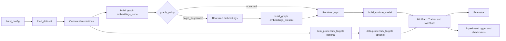

# U-CaGNN Implementation Overview

This file is the integration map for the current implementation. It stays intentionally short: use the routed docs for slice-specific detail.

## Reading map

| Need | Open |
| --- | --- |
| model modules and refined scorer | `ucagnn-architecture.md` |
| loaders, canonical schema, graph build, samplers | `ucagnn-data-pipeline.md` |
| presets and config rules | `ucagnn-config.md` |
| objectives and schedule semantics | `ucagnn-losses.md` |
| runtime flow, evaluator, checkpoints, logging | `ucagnn-training.md` |

## End-to-end flow

The diagram shows the full runtime join points. Slice-specific rules stay in the owner docs: config precedence in `ucagnn-config.md`, graph policy and propensity-target loading in `ucagnn-data-pipeline.md`, loss activation in `ucagnn-losses.md`, and checkpointing or tracking in `ucagnn-training.md`. The evaluation path now keeps thesis metrics and refined scorer diagnostics on the same propagated batches and logger pipeline.

## Source map

| Path | Responsibility |
| --- | --- |
| `src/utils/config.py` | `UCaGNNConfig` defaults, validation, preset overrides |
| `src/data/loaders/_registry.py` | dataset registry and default preprocessing presets |
| `src/data/canonical.py` | canonical interaction schema, split logic, item recency |
| `src/data/feature_policy.py` | safe-vs-optional feature registry |
| `src/data/graph_builder.py` | graph construction, optional field transfer, train-only popularity, CAGRA augmentation |
| `src/data/subgraph_sampler.py` | sampled k-hop subgraph extraction |
| `src/data/negative_sampler.py` | vectorized negative sampling |
| `src/models/embeddings.py` | embedding layer |
| `src/models/lightgcn.py` | propagation layer |
| `src/models/scoring.py` | scoring layer |
| `src/models/propensity.py` | propensity layer |
| `src/models/ucagnn.py` | model orchestration and public train/eval surfaces |
| `src/losses/loss_suite.py` | total objective assembly |
| `src/utils/trainer_runtime.py` | shared runtime, optimizer, scheduler, checkpointing |
| `src/training/mini_batch_trainer.py` | sole trainer |
| `src/training/evaluator.py` | batched full-graph evaluation |
| `experiments/run_experiment.py` | single-run orchestration and runtime assembly |
| `experiments/run_benchmark.py` | formal-run orchestration and strict saved-state handling |
| `experiments/ablation_configs.py` | thesis-facing ablation variants |
| `src/utils/experiment_logger.py` | SQLite experiment store |
| `scripts/query_results.py` | SQLite-first result inspection |
