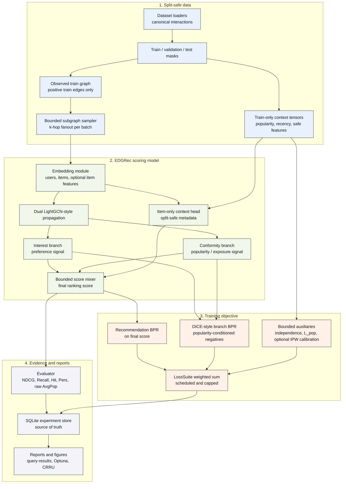

# EDGRec Architecture Pipeline

```mermaid
%% EDGRec thesis-defense architecture. Vertical layout for papers and slides.
flowchart TB
    subgraph D["1. Split-safe data"]
        direction TB
        D1["Dataset loaders<br/>canonical interactions"]
        D2["Train / validation / test masks"]
        D3["Observed train graph<br/>positive train edges only"]
        D4["Train-only context tensors<br/>popularity, recency, safe features"]
        D5["Bounded subgraph sampler<br/>k-hop fanout per batch"]
        D1 --> D2
        D2 --> D3
        D2 --> D4
        D3 --> D5
    end

    subgraph M["2. EDGRec scoring model"]
        direction TB
        M1["Embedding module<br/>users, items, optional item features"]
        M2["Dual LightGCN-style propagation"]
        M3["Interest branch<br/>preference signal"]
        M4["Conformity branch<br/>popularity / exposure signal"]
        M5["Item-only context head<br/>split-safe metadata"]
        M6["Bounded score mixer<br/>final ranking score"]
        M1 --> M2
        M2 --> M3
        M2 --> M4
        M1 --> M5
        M3 --> M6
        M4 --> M6
        M5 --> M6
    end

    subgraph O["3. Training objective"]
        direction TB
        O1["Recommendation BPR<br/>on final score"]
        O2["DICE-style branch BPR<br/>popularity-conditioned negatives"]
        O3["Bounded auxiliaries<br/>independence, L_pop, optional IPW calibration"]
        O4["LossSuite weighted sum<br/>scheduled and capped"]
        O1 --> O4
        O2 --> O4
        O3 --> O4
    end

    subgraph E["4. Evidence and reports"]
        direction TB
        E1["Evaluator<br/>NDCG, Recall, Hit, Pers, raw AvgPop"]
        E2["SQLite experiment store<br/>source of truth"]
        E3["Reports and figures<br/>query-results, Optuna, CRRU"]
        E1 --> E2
        E2 --> E3
    end

    D5 --> M1
    D4 --> M5
    M6 --> O1
    M3 --> O2
    M4 --> O2
    D4 --> O3
    O4 --> E2
    M6 --> E1

    classDef data fill:#e8f2ff,stroke:#2d3436,color:#111827;
    classDef model fill:#eef7e8,stroke:#2d3436,color:#111827;
    classDef loss fill:#fff0e6,stroke:#2d3436,color:#111827;
    classDef evidence fill:#f2f4f7,stroke:#2d3436,color:#111827;
    class D1,D2,D3,D4,D5 data;
    class M1,M2,M3,M4,M5,M6 model;
    class O1,O2,O3,O4 loss;
    class E1,E2,E3 evidence;
```
